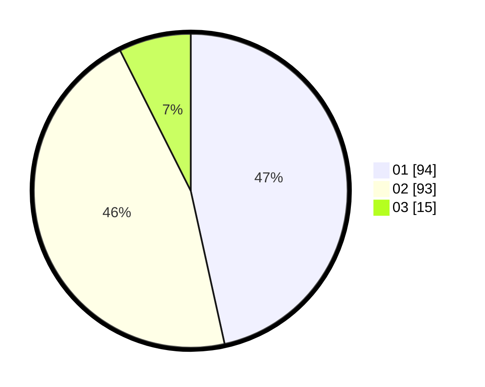

# Hasil

Hasil perolehan suara paslon dapat dilihat pada file paslon-01.txt, paslon-02.txt, dan paslon-03.txt.

Jika tidak ada, artinya data tersebut belum ada pada SIREKAP.

## Perolehan Suara

 * Paslon 01: **94**.
 * Paslon 02: **93**.
 * Paslon 03: **15**.

## Foto C Plano

https://sirekap-obj-formc.kpu.go.id/e614/pemilu/ppwp/31/75/05/10/03/3175051003023-20240215-002249--4b485f8e-fd4c-4b76-907f-18b2ddf71ae1.jpg

https://sirekap-obj-formc.kpu.go.id/e614/pemilu/ppwp/31/75/05/10/03/3175051003023-20240215-002456--27b6c27d-41c4-4cb6-b1c2-f5236393e982.jpg

https://sirekap-obj-formc.kpu.go.id/e614/pemilu/ppwp/31/75/05/10/03/3175051003023-20240215-002149--f67d1781-bfdb-4926-abe0-9f034b89a75a.jpg
