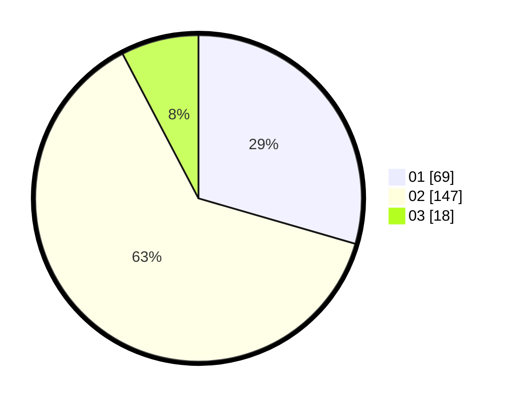

# Hasil

Hasil perolehan suara paslon dapat dilihat pada file paslon-01.txt, paslon-02.txt, dan paslon-03.txt.

Jika tidak ada, artinya data tersebut belum ada pada SIREKAP.

## Perolehan Suara

 * Paslon 01: **69**.
 * Paslon 02: **147**.
 * Paslon 03: **18**.

## Foto C Plano

https://sirekap-obj-formc.kpu.go.id/bd01/pemilu/ppwp/31/75/05/10/03/3175051003027-20240214-204352--f971219e-32df-4f75-bece-c350daa914f2.jpg

https://sirekap-obj-formc.kpu.go.id/bd01/pemilu/ppwp/31/75/05/10/03/3175051003027-20240214-204416--2d84bb0f-9089-4a30-a6f7-8c35ab403cbd.jpg

https://sirekap-obj-formc.kpu.go.id/bd01/pemilu/ppwp/31/75/05/10/03/3175051003027-20240214-204439--cd7d13b8-9d82-4e6b-a132-ed30392ccd9a.jpg
