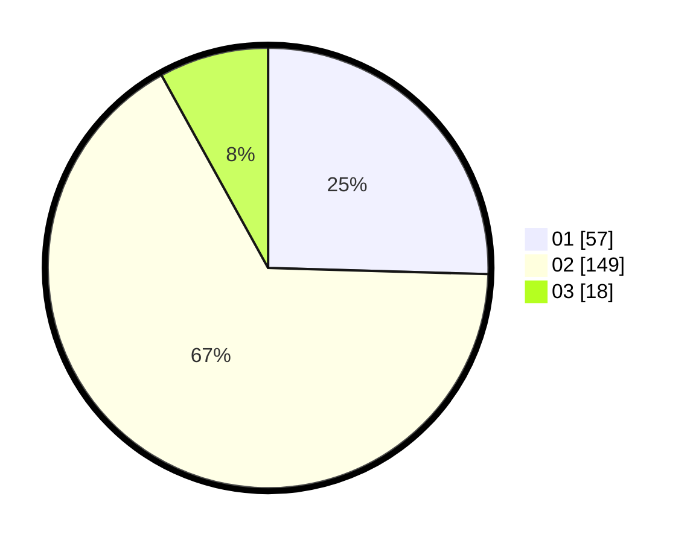

# Hasil

Hasil perolehan suara paslon dapat dilihat pada file paslon-01.txt, paslon-02.txt, dan paslon-03.txt.

Jika tidak ada, artinya data tersebut belum ada pada SIREKAP.

## Perolehan Suara

 * Paslon 01: **57**.
 * Paslon 02: **149**.
 * Paslon 03: **18**.

## Foto C Plano

https://sirekap-obj-formc.kpu.go.id/2836/pemilu/ppwp/31/75/05/10/03/3175051003030-20240214-155657--69157c62-7ff3-4454-9866-afe57d4d3725.jpg

https://sirekap-obj-formc.kpu.go.id/2836/pemilu/ppwp/31/75/05/10/03/3175051003030-20240214-155758--5cced7a2-b4da-4f53-a887-84cc4af69acd.jpg

https://sirekap-obj-formc.kpu.go.id/2836/pemilu/ppwp/31/75/05/10/03/3175051003030-20240214-160059--50d111c1-52fc-48f2-9ea7-fd4d2057a0ba.jpg

## DATA PEMILIH TETAP

Jumlah pemilih dalam DPT: **270**.
 * L: **129**.
 * P: **141**.

## DATA PENGGUNA HAK PILIH

Jumlah pengguna hak pilih dalam DPT: **217**.
 * L: **99**.
 * P: **118**.

Jumlah pengguna hak pilih dalam DPTb: **0**.
 * L: **0**.
 * P: **0**.

Jumlah pengguna hak pilih dalam DPK: **7**.
 * L: **3**.
 * P: **4**.

Jumlah pengguna hak pilih: **224**.
 * L: **102**.
 * P: **122**.

## JUMLAH SUARA SAH DAN TIDAK SAH

JUMLAH SELURUH SUARA SAH: **224**.

JUMLAH SUARA TIDAK SAH: **0**.

JUMLAH SELURUH SUARA SAH DAN SUARA TIDAK SAH: **224**.
