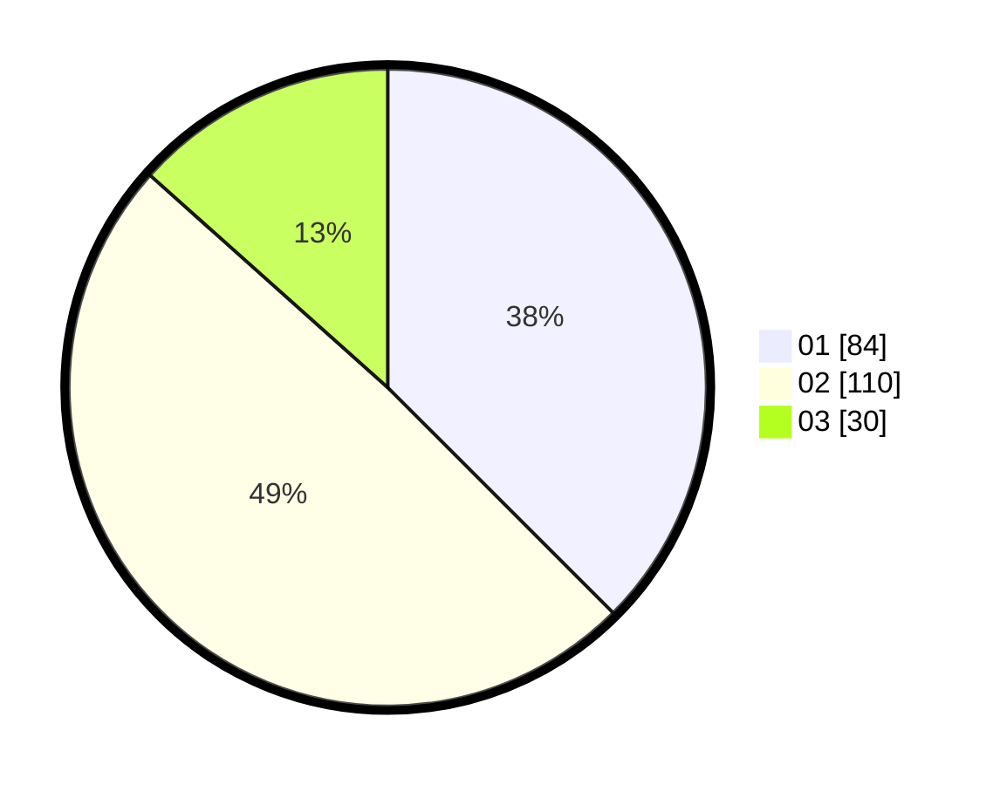

# Hasil

Hasil perolehan suara paslon dapat dilihat pada file paslon-01.txt, paslon-02.txt, dan paslon-03.txt.

Jika tidak ada, artinya data tersebut belum ada pada SIREKAP.

## Perolehan Suara

 * Paslon 01: **84**.
 * Paslon 02: **110**.
 * Paslon 03: **30**.

## Foto C Plano

https://sirekap-obj-formc.kpu.go.id/c53f/pemilu/ppwp/31/75/05/10/03/3175051003037-20240214-233759--0dbeeb2f-6844-41bd-9a0d-ad269dfc5b7a.jpg

https://sirekap-obj-formc.kpu.go.id/c53f/pemilu/ppwp/31/75/05/10/03/3175051003037-20240214-233820--405614b7-d6a0-4fce-a72c-bc77b4b4b499.jpg

https://sirekap-obj-formc.kpu.go.id/c53f/pemilu/ppwp/31/75/05/10/03/3175051003037-20240214-233844--34326041-07b8-475f-b1c9-aab89fca3dc4.jpg
