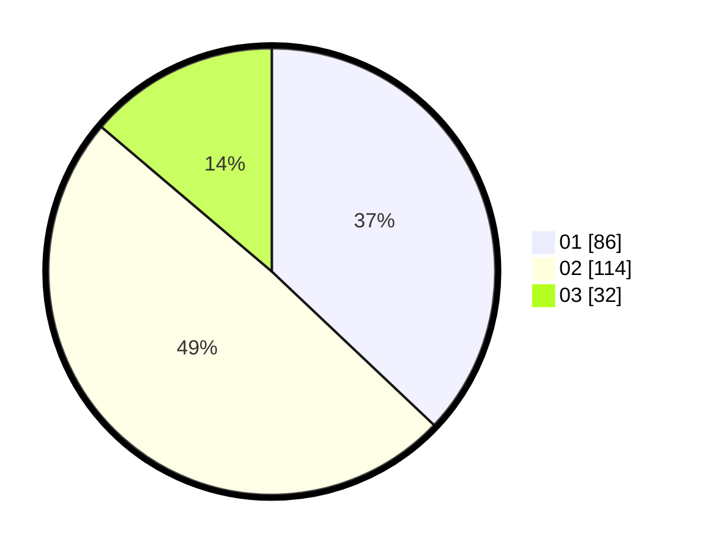

# Hasil

Hasil perolehan suara paslon dapat dilihat pada file paslon-01.txt, paslon-02.txt, dan paslon-03.txt.

Jika tidak ada, artinya data tersebut belum ada pada SIREKAP.

## Perolehan Suara

 * Paslon 01: **86**.
 * Paslon 02: **114**.
 * Paslon 03: **32**.

## Foto C Plano

https://sirekap-obj-formc.kpu.go.id/3845/pemilu/ppwp/31/75/05/10/03/3175051003040-20240215-023936--299229ae-4571-4b8a-a54a-0508d60cf05e.jpg

https://sirekap-obj-formc.kpu.go.id/3845/pemilu/ppwp/31/75/05/10/03/3175051003040-20240215-024035--f0163d36-b1d6-4d62-920c-0f1f4f7c1dea.jpg

https://sirekap-obj-formc.kpu.go.id/3845/pemilu/ppwp/31/75/05/10/03/3175051003040-20240215-024012--0ee9b268-a446-4de6-be14-3861f3294df9.jpg

## DATA PEMILIH TETAP

Jumlah pemilih dalam DPT: **283**.
 * L: **126**.
 * P: **157**.

## DATA PENGGUNA HAK PILIH

Jumlah pengguna hak pilih dalam DPT: **229**.
 * L: **93**.
 * P: **136**.

Jumlah pengguna hak pilih dalam DPTb: **0**.
 * L: **0**.
 * P: **0**.

Jumlah pengguna hak pilih dalam DPK: **4**.
 * L: **1**.
 * P: **3**.

Jumlah pengguna hak pilih: **233**.
 * L: **94**.
 * P: **139**.

## JUMLAH SUARA SAH DAN TIDAK SAH

JUMLAH SELURUH SUARA SAH: **232**.

JUMLAH SUARA TIDAK SAH: **1**.

JUMLAH SELURUH SUARA SAH DAN SUARA TIDAK SAH: **233**.
