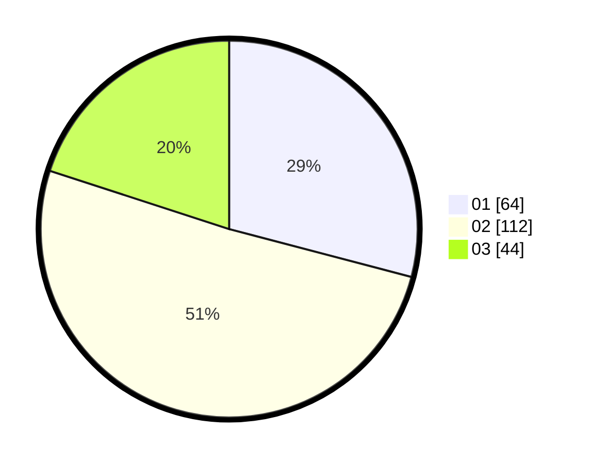

# Hasil

Hasil perolehan suara paslon dapat dilihat pada file paslon-01.txt, paslon-02.txt, dan paslon-03.txt.

Jika tidak ada, artinya data tersebut belum ada pada SIREKAP.

## Perolehan Suara

 * Paslon 01: **64**.
 * Paslon 02: **112**.
 * Paslon 03: **44**.

## Foto C Plano

https://sirekap-obj-formc.kpu.go.id/77e4/pemilu/ppwp/31/75/05/10/03/3175051003044-20240215-084253--3c893dc9-142e-48ed-9a4c-ee4a5ffb9632.jpg

https://sirekap-obj-formc.kpu.go.id/77e4/pemilu/ppwp/31/75/05/10/03/3175051003044-20240214-155409--0f0de438-1009-4958-b797-50d81946cde8.jpg

https://sirekap-obj-formc.kpu.go.id/77e4/pemilu/ppwp/31/75/05/10/03/3175051003044-20240214-155419--ec2c3506-8769-4fcc-9ac2-7b300ef46fe0.jpg

## DATA PEMILIH TETAP

Jumlah pemilih dalam DPT: **270**.
 * L: **141**.
 * P: **129**.

## DATA PENGGUNA HAK PILIH

Jumlah pengguna hak pilih dalam DPT: **226**.
 * L: **112**.
 * P: **114**.

Jumlah pengguna hak pilih dalam DPTb: **0**.
 * L: **0**.
 * P: **0**.

Jumlah pengguna hak pilih dalam DPK: **2**.
 * L: **1**.
 * P: **1**.

Jumlah pengguna hak pilih: **228**.
 * L: **113**.
 * P: **115**.

## JUMLAH SUARA SAH DAN TIDAK SAH

JUMLAH SELURUH SUARA SAH: **220**.

JUMLAH SUARA TIDAK SAH: **8**.

JUMLAH SELURUH SUARA SAH DAN SUARA TIDAK SAH: **228**.
