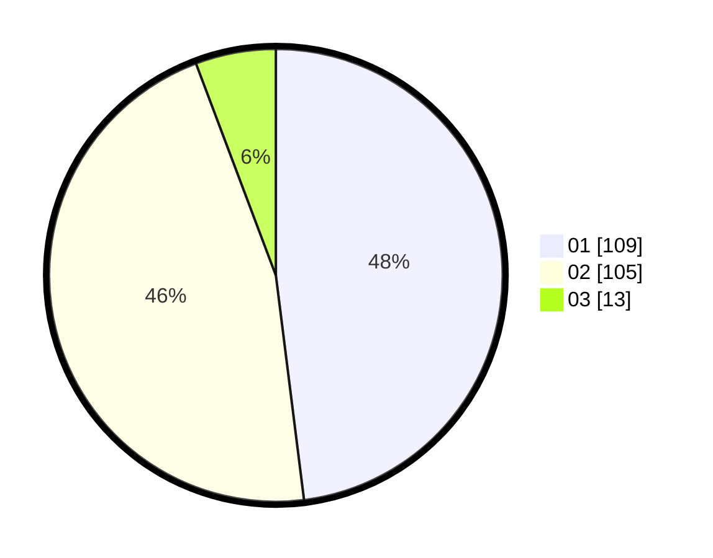

# Hasil

Hasil perolehan suara paslon dapat dilihat pada file paslon-01.txt, paslon-02.txt, dan paslon-03.txt.

Jika tidak ada, artinya data tersebut belum ada pada SIREKAP.

## Perolehan Suara

 * Paslon 01: **109**.
 * Paslon 02: **105**.
 * Paslon 03: **13**.

## Foto C Plano

https://sirekap-obj-formc.kpu.go.id/4bfa/pemilu/ppwp/31/75/05/10/03/3175051003046-20240216-093222--44abb9da-6835-4c25-bfbb-15ec6e5b199f.jpg

https://sirekap-obj-formc.kpu.go.id/4bfa/pemilu/ppwp/31/75/05/10/03/3175051003046-20240216-093224--df9d383f-8c4d-4511-a7c0-07dfefdf2593.jpg

https://sirekap-obj-formc.kpu.go.id/4bfa/pemilu/ppwp/31/75/05/10/03/3175051003046-20240216-093223--8540a599-8d72-4cbf-a497-ffb643575865.jpg

## DATA PEMILIH TETAP

Jumlah pemilih dalam DPT: **271**.
 * L: **129**.
 * P: **142**.

## DATA PENGGUNA HAK PILIH

Jumlah pengguna hak pilih dalam DPT: **225**.
 * L: **104**.
 * P: **121**.

Jumlah pengguna hak pilih dalam DPTb: **1**.
 * L: **0**.
 * P: **1**.

Jumlah pengguna hak pilih dalam DPK: **2**.
 * L: **0**.
 * P: **2**.

Jumlah pengguna hak pilih: **228**.
 * L: **104**.
 * P: **124**.

## JUMLAH SUARA SAH DAN TIDAK SAH

JUMLAH SELURUH SUARA SAH: **227**.

JUMLAH SUARA TIDAK SAH: **1**.

JUMLAH SELURUH SUARA SAH DAN SUARA TIDAK SAH: **228**.
