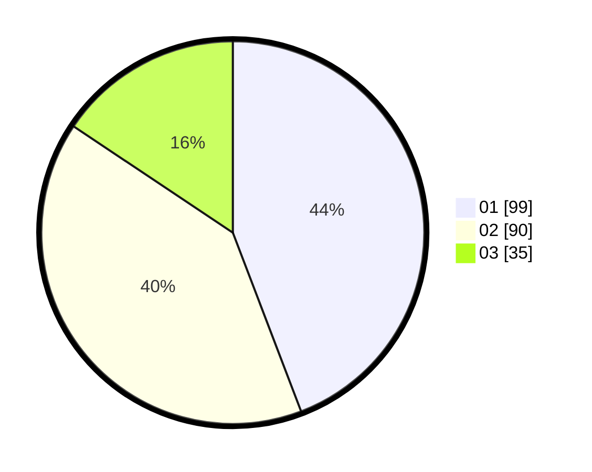

# Hasil

Hasil perolehan suara paslon dapat dilihat pada file paslon-01.txt, paslon-02.txt, dan paslon-03.txt.

Jika tidak ada, artinya data tersebut belum ada pada SIREKAP.

## Perolehan Suara

 * Paslon 01: **99**.
 * Paslon 02: **90**.
 * Paslon 03: **35**.

## Foto C Plano

https://sirekap-obj-formc.kpu.go.id/749e/pemilu/ppwp/31/75/05/10/03/3175051003048-20240214-211047--bc8541b3-7dc8-4931-a5f3-7dbc6c932e4c.jpg

https://sirekap-obj-formc.kpu.go.id/749e/pemilu/ppwp/31/75/05/10/03/3175051003048-20240214-210958--9948af1d-2554-4c0a-8ced-b7ab417e16ee.jpg

https://sirekap-obj-formc.kpu.go.id/749e/pemilu/ppwp/31/75/05/10/03/3175051003048-20240214-211149--945cd3fe-c6d2-4df9-b12a-dd8fdcbc9fcf.jpg

## DATA PEMILIH TETAP

Jumlah pemilih dalam DPT: **264**.
 * L: **135**.
 * P: **129**.

## DATA PENGGUNA HAK PILIH

Jumlah pengguna hak pilih dalam DPT: **224**.
 * L: **112**.
 * P: **112**.

Jumlah pengguna hak pilih dalam DPTb: **0**.
 * L: **0**.
 * P: **0**.

Jumlah pengguna hak pilih dalam DPK: **1**.
 * L: **1**.
 * P: **0**.

Jumlah pengguna hak pilih: **225**.
 * L: **113**.
 * P: **112**.

## JUMLAH SUARA SAH DAN TIDAK SAH

JUMLAH SELURUH SUARA SAH: **224**.

JUMLAH SUARA TIDAK SAH: **1**.

JUMLAH SELURUH SUARA SAH DAN SUARA TIDAK SAH: **225**.
