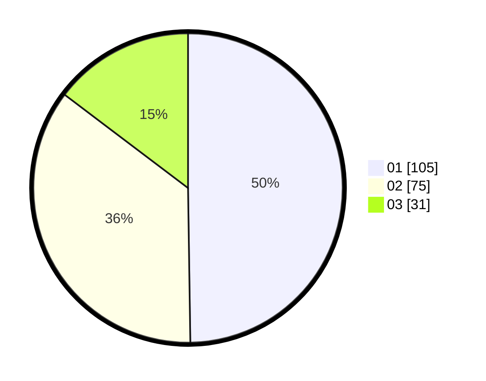

# Hasil

Hasil perolehan suara paslon dapat dilihat pada file paslon-01.txt, paslon-02.txt, dan paslon-03.txt.

Jika tidak ada, artinya data tersebut belum ada pada SIREKAP.

## Perolehan Suara

 * Paslon 01: **105**.
 * Paslon 02: **75**.
 * Paslon 03: **31**.

## Foto C Plano

https://sirekap-obj-formc.kpu.go.id/100e/pemilu/ppwp/31/75/05/10/03/3175051003052-20240214-220419--b077fdcf-d771-4dae-83c3-0a7629677f7e.jpg

https://sirekap-obj-formc.kpu.go.id/100e/pemilu/ppwp/31/75/05/10/03/3175051003052-20240215-173245--29c1adfd-32c9-4fa7-8ab4-603312304c76.jpg
