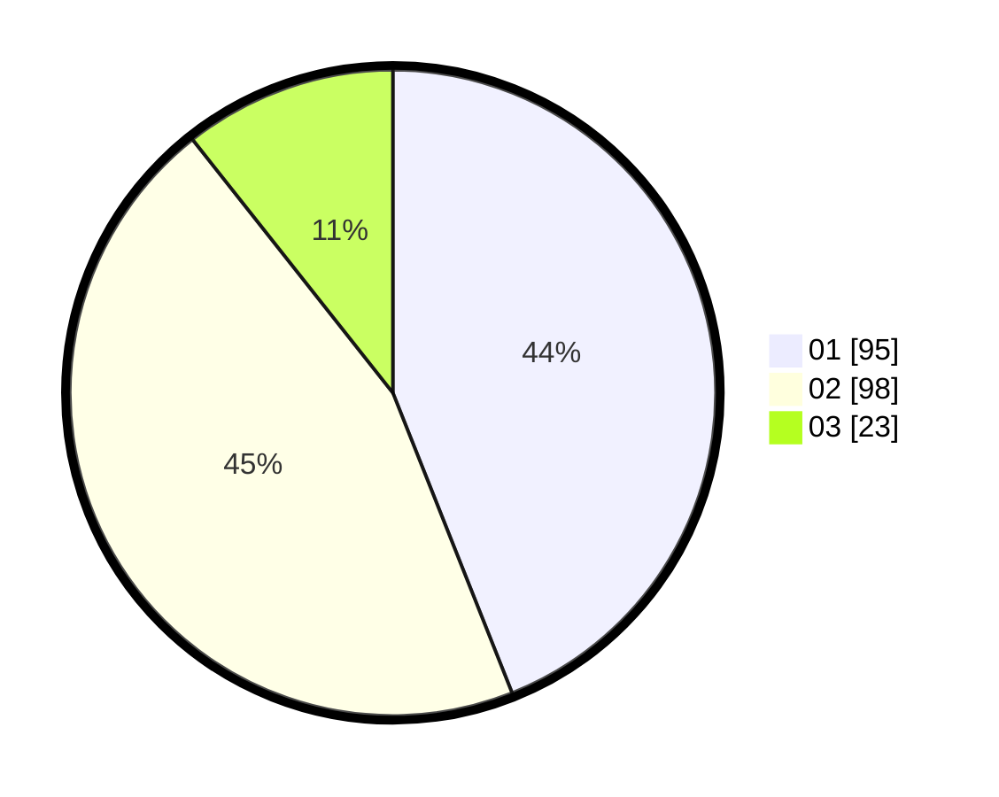

# Hasil

Hasil perolehan suara paslon dapat dilihat pada file paslon-01.txt, paslon-02.txt, dan paslon-03.txt.

Jika tidak ada, artinya data tersebut belum ada pada SIREKAP.

## Perolehan Suara

 * Paslon 01: **95**.
 * Paslon 02: **98**.
 * Paslon 03: **23**.

## Foto C Plano

https://sirekap-obj-formc.kpu.go.id/9441/pemilu/ppwp/31/75/05/10/03/3175051003054-20240214-235438--1b677845-0e7e-4d41-8abf-6abd9f3684cd.jpg

https://sirekap-obj-formc.kpu.go.id/9441/pemilu/ppwp/31/75/05/10/03/3175051003054-20240214-235541--1150803c-af6d-466a-8733-08faa11b98b4.jpg

https://sirekap-obj-formc.kpu.go.id/9441/pemilu/ppwp/31/75/05/10/03/3175051003054-20240214-235635--ccdd8838-2c28-4ac6-aae6-5c4bcf5be0e1.jpg
