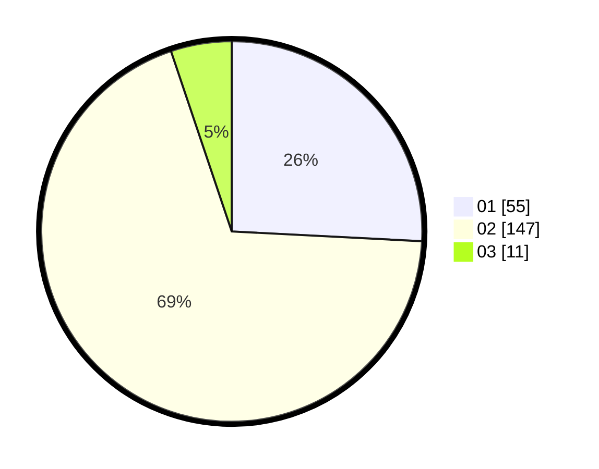

# Hasil

Hasil perolehan suara paslon dapat dilihat pada file paslon-01.txt, paslon-02.txt, dan paslon-03.txt.

Jika tidak ada, artinya data tersebut belum ada pada SIREKAP.

## Perolehan Suara

 * Paslon 01: **55**.
 * Paslon 02: **147**.
 * Paslon 03: **11**.

## Foto C Plano

https://sirekap-obj-formc.kpu.go.id/5ab7/pemilu/ppwp/31/75/05/10/03/3175051003066-20240214-230638--a6b62bce-b1c7-468c-9550-1111c38bd7af.jpg

https://sirekap-obj-formc.kpu.go.id/5ab7/pemilu/ppwp/31/75/05/10/03/3175051003066-20240214-230630--90687f9e-b85f-45da-b94f-0c9a15354701.jpg

https://sirekap-obj-formc.kpu.go.id/5ab7/pemilu/ppwp/31/75/05/10/03/3175051003066-20240214-233357--e37710e6-fcae-40c0-8425-d940bfb8d3da.jpg
