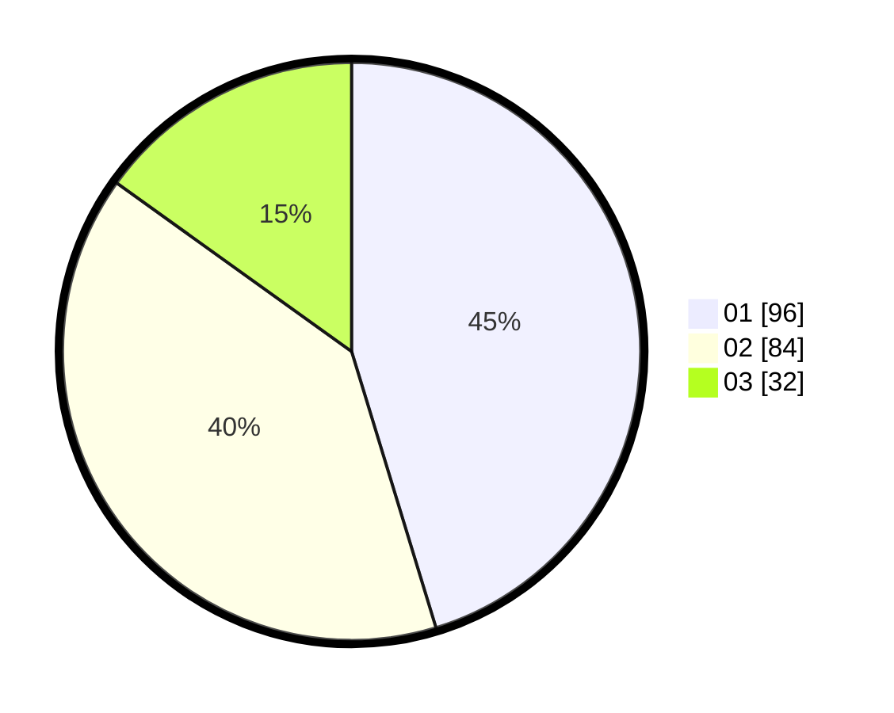

# Hasil

Hasil perolehan suara paslon dapat dilihat pada file paslon-01.txt, paslon-02.txt, dan paslon-03.txt.

Jika tidak ada, artinya data tersebut belum ada pada SIREKAP.

## Perolehan Suara

 * Paslon 01: **96**.
 * Paslon 02: **84**.
 * Paslon 03: **32**.

## Foto C Plano

https://sirekap-obj-formc.kpu.go.id/2362/pemilu/ppwp/31/75/05/10/03/3175051003068-20240215-013550--c76b7287-b3e6-40f2-bd09-992a5fd601be.jpg

https://sirekap-obj-formc.kpu.go.id/2362/pemilu/ppwp/31/75/05/10/03/3175051003068-20240215-014544--ded31cdb-8ab9-4d1e-a2f4-a58e2bdffd4c.jpg

https://sirekap-obj-formc.kpu.go.id/2362/pemilu/ppwp/31/75/05/10/03/3175051003068-20240215-015041--e9035076-e697-4ac5-a3f2-ba4360d08f19.jpg
