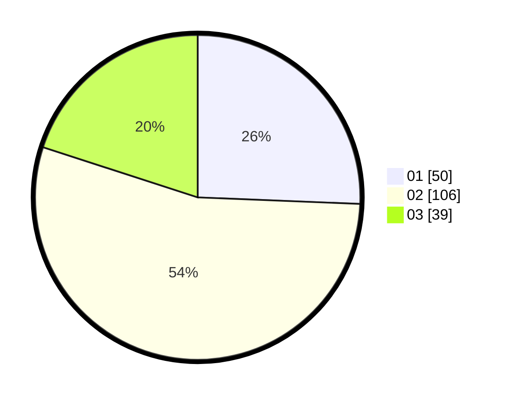

# Hasil

Hasil perolehan suara paslon dapat dilihat pada file paslon-01.txt, paslon-02.txt, dan paslon-03.txt.

Jika tidak ada, artinya data tersebut belum ada pada SIREKAP.

## Perolehan Suara

 * Paslon 01: **50**.
 * Paslon 02: **106**.
 * Paslon 03: **39**.

## Foto C Plano

https://sirekap-obj-formc.kpu.go.id/a854/pemilu/ppwp/31/75/05/10/03/3175051003079-20240214-191134--7e40bf04-085d-4753-89e2-9faf69b43bab.jpg

https://sirekap-obj-formc.kpu.go.id/a854/pemilu/ppwp/31/75/05/10/03/3175051003079-20240214-193054--805f1855-3b94-4ea0-b0e5-d71fe30388a7.jpg

https://sirekap-obj-formc.kpu.go.id/a854/pemilu/ppwp/31/75/05/10/03/3175051003079-20240214-205027--60532e4b-d5b2-4645-9541-ab7c0dd17f2a.jpg

## DATA PEMILIH TETAP

Jumlah pemilih dalam DPT: **259**.
 * L: **130**.
 * P: **129**.

## DATA PENGGUNA HAK PILIH

Jumlah pengguna hak pilih dalam DPT: **194**.
 * L: **91**.
 * P: **103**.

Jumlah pengguna hak pilih dalam DPTb: **0**.
 * L: **0**.
 * P: **0**.

Jumlah pengguna hak pilih dalam DPK: **2**.
 * L: **1**.
 * P: **1**.

Jumlah pengguna hak pilih: **196**.
 * L: **92**.
 * P: **104**.

## JUMLAH SUARA SAH DAN TIDAK SAH

JUMLAH SELURUH SUARA SAH: **195**.

JUMLAH SUARA TIDAK SAH: **1**.

JUMLAH SELURUH SUARA SAH DAN SUARA TIDAK SAH: **196**.
