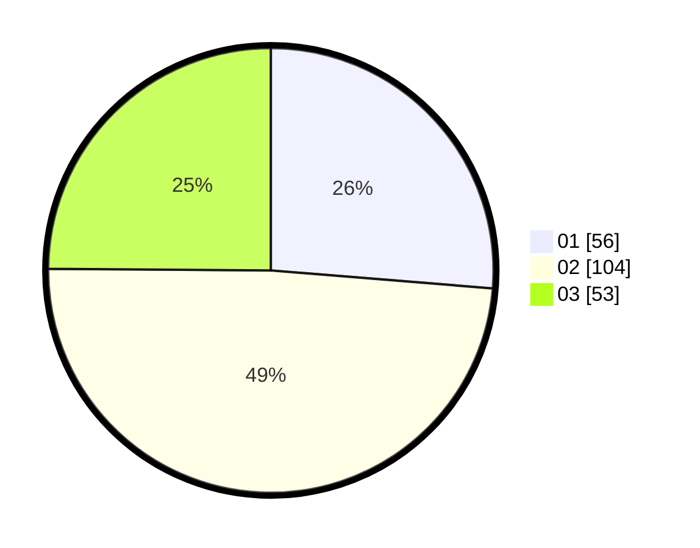

# Hasil

Hasil perolehan suara paslon dapat dilihat pada file paslon-01.txt, paslon-02.txt, dan paslon-03.txt.

Jika tidak ada, artinya data tersebut belum ada pada SIREKAP.

## Perolehan Suara

 * Paslon 01: **56**.
 * Paslon 02: **104**.
 * Paslon 03: **53**.

## Foto C Plano

https://sirekap-obj-formc.kpu.go.id/c967/pemilu/ppwp/31/75/05/10/03/3175051003082-20240215-024440--e668c9dc-6a56-459e-994e-2f44a20eec7f.jpg

https://sirekap-obj-formc.kpu.go.id/c967/pemilu/ppwp/31/75/05/10/03/3175051003082-20240215-024737--a5ec3fd3-8c2a-447b-baaa-64bea46e3252.jpg

https://sirekap-obj-formc.kpu.go.id/c967/pemilu/ppwp/31/75/05/10/03/3175051003082-20240215-024820--887db1c5-e56c-4cd6-8fd2-6bdd2b88f552.jpg
