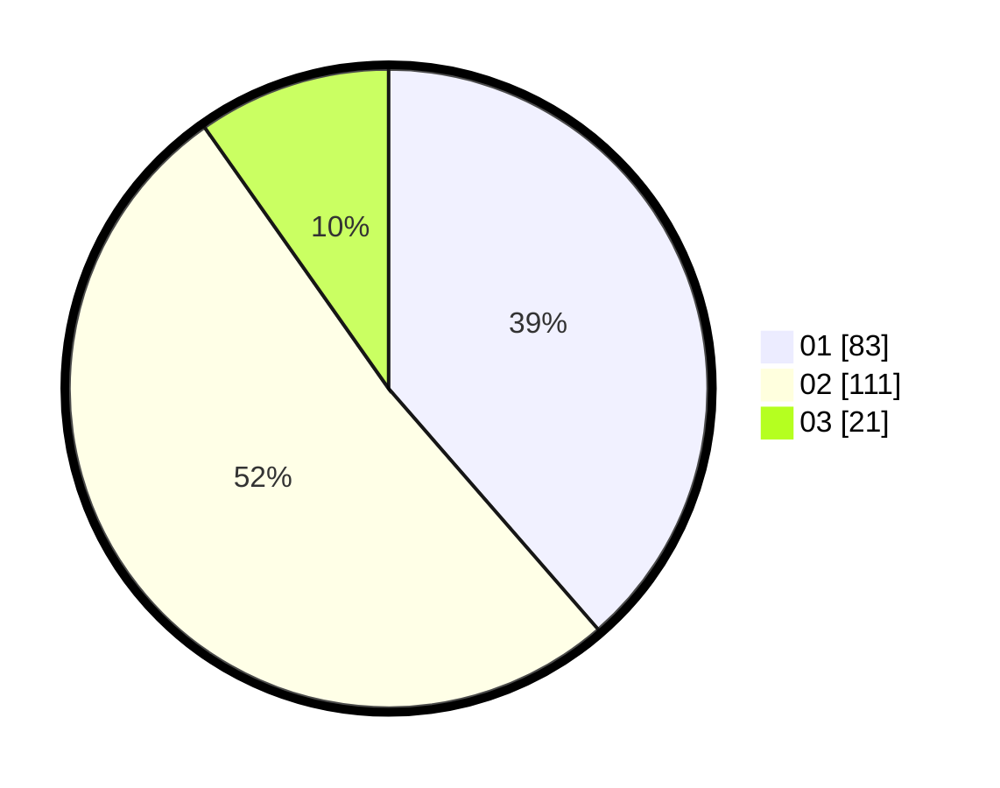

# Hasil

Hasil perolehan suara paslon dapat dilihat pada file paslon-01.txt, paslon-02.txt, dan paslon-03.txt.

Jika tidak ada, artinya data tersebut belum ada pada SIREKAP.

## Perolehan Suara

 * Paslon 01: **83**.
 * Paslon 02: **111**.
 * Paslon 03: **21**.

## Foto C Plano

https://sirekap-obj-formc.kpu.go.id/c506/pemilu/ppwp/31/75/05/10/03/3175051003083-20240215-034847--cf29be0a-f726-4380-a83d-9e4a5592d3bb.jpg

https://sirekap-obj-formc.kpu.go.id/c506/pemilu/ppwp/31/75/05/10/03/3175051003083-20240215-034948--50d0dd18-c54a-438d-88b5-a9e3a71b780d.jpg

https://sirekap-obj-formc.kpu.go.id/c506/pemilu/ppwp/31/75/05/10/03/3175051003083-20240215-035108--4fc7da4b-3fab-4f70-bb9e-ffbd605abc6c.jpg
