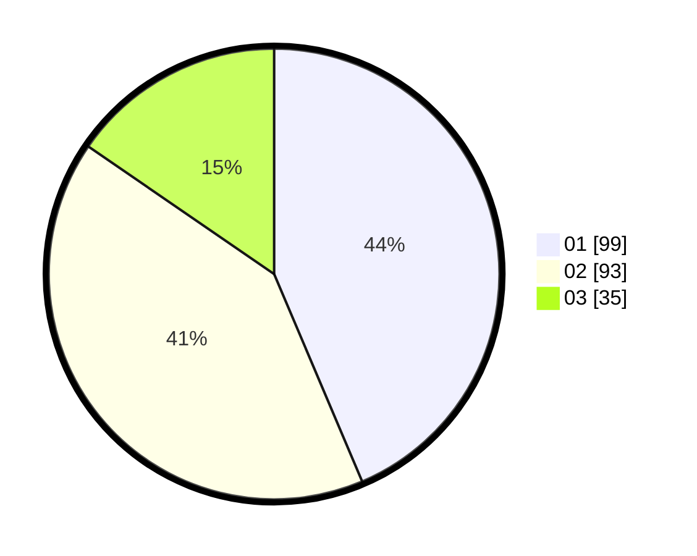

# Hasil

Hasil perolehan suara paslon dapat dilihat pada file paslon-01.txt, paslon-02.txt, dan paslon-03.txt.

Jika tidak ada, artinya data tersebut belum ada pada SIREKAP.

## Perolehan Suara

 * Paslon 01: **99**.
 * Paslon 02: **93**.
 * Paslon 03: **35**.

## Foto C Plano

https://sirekap-obj-formc.kpu.go.id/f8eb/pemilu/ppwp/31/75/05/10/03/3175051003086-20240215-022937--d3be8ddc-9b13-42d4-888f-acf6af16406e.jpg

https://sirekap-obj-formc.kpu.go.id/f8eb/pemilu/ppwp/31/75/05/10/03/3175051003086-20240215-023024--913c7fe1-a635-4492-aad0-793ddd08b9f4.jpg

https://sirekap-obj-formc.kpu.go.id/f8eb/pemilu/ppwp/31/75/05/10/03/3175051003086-20240215-023113--5f108cc4-540d-4407-88ac-8dea874e3cd6.jpg
