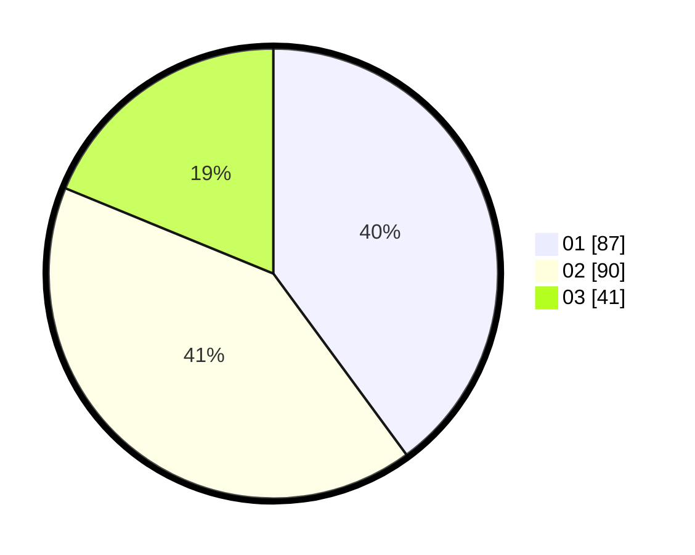

# Hasil

Hasil perolehan suara paslon dapat dilihat pada file paslon-01.txt, paslon-02.txt, dan paslon-03.txt.

Jika tidak ada, artinya data tersebut belum ada pada SIREKAP.

## Perolehan Suara

 * Paslon 01: **87**.
 * Paslon 02: **90**.
 * Paslon 03: **41**.

## Foto C Plano

https://sirekap-obj-formc.kpu.go.id/772c/pemilu/ppwp/31/75/05/10/03/3175051003088-20240214-221753--c3e4069b-a90c-4dee-934b-004009bee278.jpg

https://sirekap-obj-formc.kpu.go.id/772c/pemilu/ppwp/31/75/05/10/03/3175051003088-20240214-222816--833a0ac0-e42e-47d8-af29-d826eb742541.jpg

https://sirekap-obj-formc.kpu.go.id/772c/pemilu/ppwp/31/75/05/10/03/3175051003088-20240214-222100--608ec644-b6a0-4a03-8fbc-6807eb679dc9.jpg
