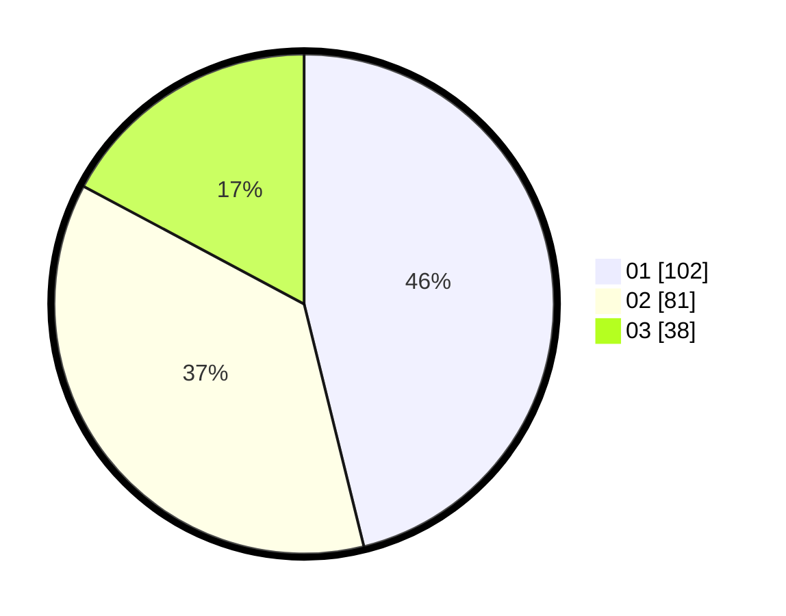

# Hasil

Hasil perolehan suara paslon dapat dilihat pada file paslon-01.txt, paslon-02.txt, dan paslon-03.txt.

Jika tidak ada, artinya data tersebut belum ada pada SIREKAP.

## Perolehan Suara

 * Paslon 01: **102**.
 * Paslon 02: **81**.
 * Paslon 03: **38**.

## Foto C Plano

https://sirekap-obj-formc.kpu.go.id/15a5/pemilu/ppwp/31/75/05/10/03/3175051003089-20240214-223449--60f2720c-94f8-4205-8083-fe8ff08a45d2.jpg

https://sirekap-obj-formc.kpu.go.id/15a5/pemilu/ppwp/31/75/05/10/03/3175051003089-20240214-212237--e36cce09-85f4-41d5-be91-0159acdc93f2.jpg

https://sirekap-obj-formc.kpu.go.id/15a5/pemilu/ppwp/31/75/05/10/03/3175051003089-20240214-223815--a42bab97-71b0-4efc-8187-7af91fb347df.jpg
