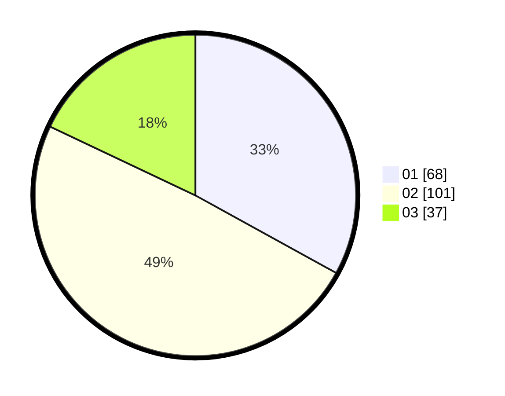

# Hasil

Hasil perolehan suara paslon dapat dilihat pada file paslon-01.txt, paslon-02.txt, dan paslon-03.txt.

Jika tidak ada, artinya data tersebut belum ada pada SIREKAP.

## Perolehan Suara

 * Paslon 01: **68**.
 * Paslon 02: **101**.
 * Paslon 03: **37**.

## Foto C Plano

https://sirekap-obj-formc.kpu.go.id/1a7a/pemilu/ppwp/31/75/05/10/03/3175051003103-20240214-223322--31e99ab3-679c-4191-8e6d-445beaf37721.jpg

https://sirekap-obj-formc.kpu.go.id/1a7a/pemilu/ppwp/31/75/05/10/03/3175051003103-20240214-223405--a50906a8-1a8e-4856-99cc-40474e936c72.jpg

https://sirekap-obj-formc.kpu.go.id/1a7a/pemilu/ppwp/31/75/05/10/03/3175051003103-20240214-223622--4f82f853-43e5-449b-b9e7-9cf7c5e5ae13.jpg
