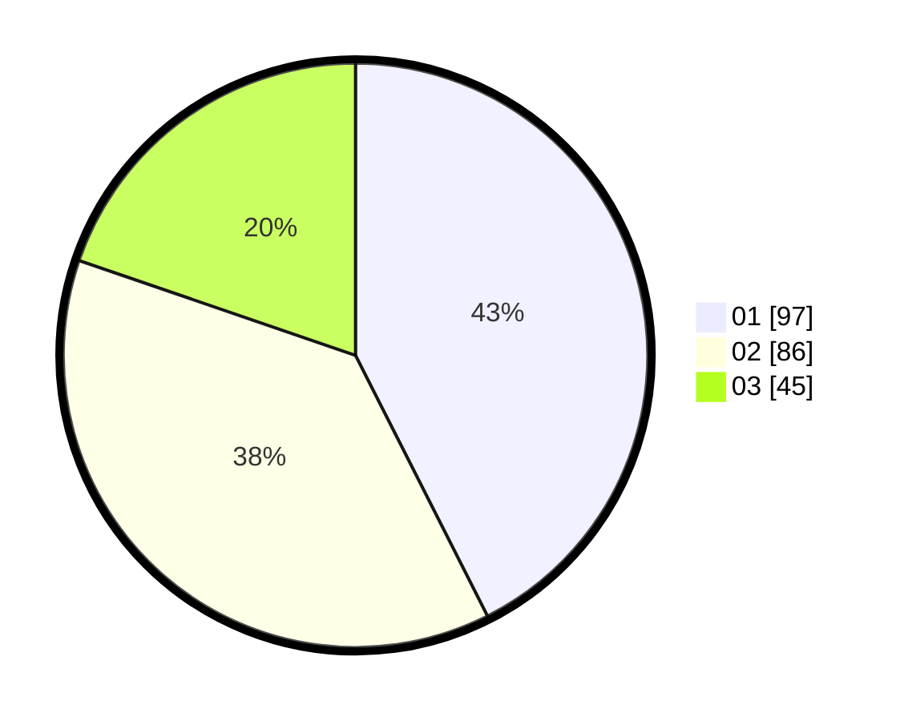

# Hasil

Hasil perolehan suara paslon dapat dilihat pada file paslon-01.txt, paslon-02.txt, dan paslon-03.txt.

Jika tidak ada, artinya data tersebut belum ada pada SIREKAP.

## Perolehan Suara

 * Paslon 01: **97**.
 * Paslon 02: **86**.
 * Paslon 03: **45**.

## Foto C Plano

https://sirekap-obj-formc.kpu.go.id/c518/pemilu/ppwp/31/75/05/10/03/3175051003104-20240214-225743--9d66451a-bc89-4a99-86d9-a73d8a347670.jpg

https://sirekap-obj-formc.kpu.go.id/c518/pemilu/ppwp/31/75/05/10/03/3175051003104-20240214-230021--5fa00cb4-0e15-42e5-acd8-006ab730cf15.jpg

https://sirekap-obj-formc.kpu.go.id/c518/pemilu/ppwp/31/75/05/10/03/3175051003104-20240214-230228--a0fcbbaf-8c9d-4160-8ef6-49e73e063e0b.jpg
