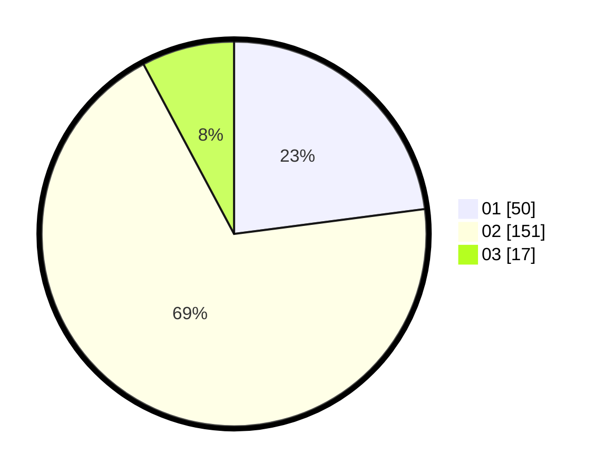

# Hasil

Hasil perolehan suara paslon dapat dilihat pada file paslon-01.txt, paslon-02.txt, dan paslon-03.txt.

Jika tidak ada, artinya data tersebut belum ada pada SIREKAP.

## Perolehan Suara

 * Paslon 01: **50**.
 * Paslon 02: **151**.
 * Paslon 03: **17**.

## Foto C Plano

https://sirekap-obj-formc.kpu.go.id/ee98/pemilu/ppwp/31/75/05/10/03/3175051003106-20240215-225707--ac5bbde3-ae38-4dc3-8803-525dec579659.jpg

https://sirekap-obj-formc.kpu.go.id/ee98/pemilu/ppwp/31/75/05/10/03/3175051003106-20240215-230043--6ed43737-3dcb-4f96-bd96-7c50e0a99016.jpg

https://sirekap-obj-formc.kpu.go.id/ee98/pemilu/ppwp/31/75/05/10/03/3175051003106-20240215-230309--71a33df5-b77e-4170-9119-59b8088c8c49.jpg
