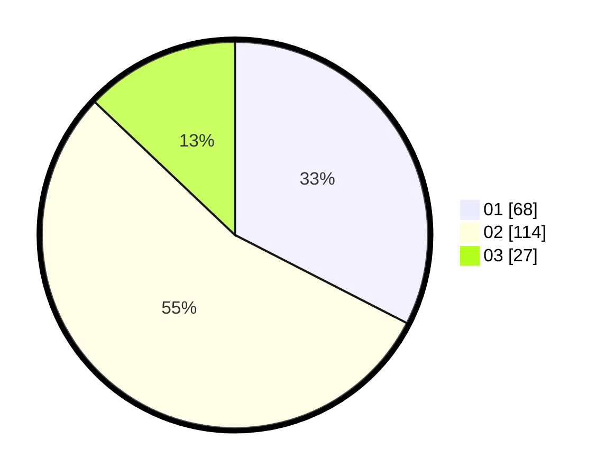

# Hasil

Hasil perolehan suara paslon dapat dilihat pada file paslon-01.txt, paslon-02.txt, dan paslon-03.txt.

Jika tidak ada, artinya data tersebut belum ada pada SIREKAP.

## Perolehan Suara

 * Paslon 01: **68**.
 * Paslon 02: **114**.
 * Paslon 03: **27**.

## Foto C Plano

https://sirekap-obj-formc.kpu.go.id/b625/pemilu/ppwp/31/75/05/10/03/3175051003107-20240214-224040--e9d9b28e-802c-4460-8d00-e4a2f7702050.jpg

https://sirekap-obj-formc.kpu.go.id/b625/pemilu/ppwp/31/75/05/10/03/3175051003107-20240214-224136--43537255-5e74-4bdb-b0c2-0cf80c25591b.jpg

https://sirekap-obj-formc.kpu.go.id/b625/pemilu/ppwp/31/75/05/10/03/3175051003107-20240214-224222--d2e10d86-3b7d-4d73-bf96-a030e6defa7c.jpg
