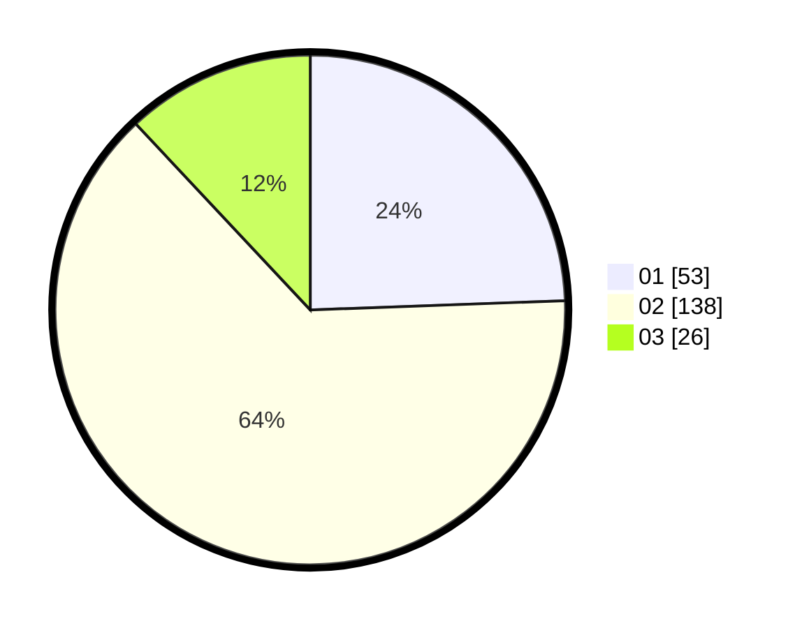

# Hasil

Hasil perolehan suara paslon dapat dilihat pada file paslon-01.txt, paslon-02.txt, dan paslon-03.txt.

Jika tidak ada, artinya data tersebut belum ada pada SIREKAP.

## Perolehan Suara

 * Paslon 01: **53**.
 * Paslon 02: **138**.
 * Paslon 03: **26**.

## Foto C Plano

https://sirekap-obj-formc.kpu.go.id/3ad6/pemilu/ppwp/31/75/05/10/03/3175051003118-20240215-201818--7fbe9e49-48e1-44f3-ab3b-fd95b01899d9.jpg

https://sirekap-obj-formc.kpu.go.id/3ad6/pemilu/ppwp/31/75/05/10/03/3175051003118-20240215-201558--e146db8f-5f5b-4ef9-8086-d0f1f6263193.jpg

https://sirekap-obj-formc.kpu.go.id/3ad6/pemilu/ppwp/31/75/05/10/03/3175051003118-20240215-021141--914b9daa-031f-4606-8409-c4b257c08029.jpg
