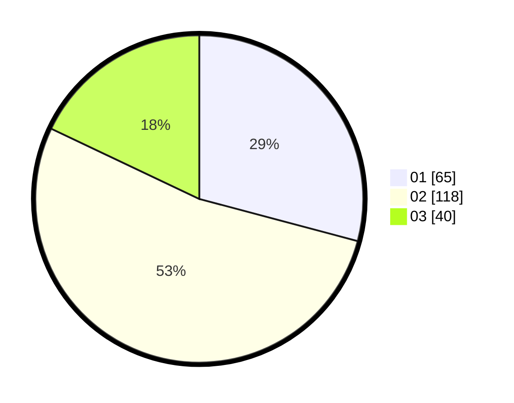

# Hasil

Hasil perolehan suara paslon dapat dilihat pada file paslon-01.txt, paslon-02.txt, dan paslon-03.txt.

Jika tidak ada, artinya data tersebut belum ada pada SIREKAP.

## Perolehan Suara

 * Paslon 01: **65**.
 * Paslon 02: **118**.
 * Paslon 03: **40**.

## Foto C Plano

https://sirekap-obj-formc.kpu.go.id/9436/pemilu/ppwp/31/75/05/10/03/3175051003128-20240214-222156--67f53b6b-30f7-41f6-8d47-9aabd78dce81.jpg

https://sirekap-obj-formc.kpu.go.id/9436/pemilu/ppwp/31/75/05/10/03/3175051003128-20240214-222345--80647c67-b4ca-461d-8e1e-16f33e1e312d.jpg

https://sirekap-obj-formc.kpu.go.id/9436/pemilu/ppwp/31/75/05/10/03/3175051003128-20240214-222518--b2348059-640f-4739-9313-f277723b94eb.jpg
