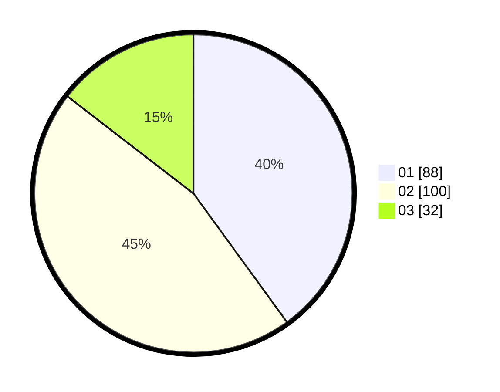

# Hasil

Hasil perolehan suara paslon dapat dilihat pada file paslon-01.txt, paslon-02.txt, dan paslon-03.txt.

Jika tidak ada, artinya data tersebut belum ada pada SIREKAP.

## Perolehan Suara

 * Paslon 01: **88**.
 * Paslon 02: **100**.
 * Paslon 03: **32**.

## Foto C Plano

https://sirekap-obj-formc.kpu.go.id/37c3/pemilu/ppwp/31/75/05/10/03/3175051003129-20240214-190302--b399aeaa-3442-4ef6-b675-f2d74a22fc48.jpg

https://sirekap-obj-formc.kpu.go.id/37c3/pemilu/ppwp/31/75/05/10/03/3175051003129-20240214-190315--1fad3d64-8224-47af-84e2-3d03396b48ea.jpg

https://sirekap-obj-formc.kpu.go.id/37c3/pemilu/ppwp/31/75/05/10/03/3175051003129-20240214-190335--42ab7943-71dc-4945-a4a3-a65cf7b05eb6.jpg

## DATA PEMILIH TETAP

Jumlah pemilih dalam DPT: **255**.
 * L: **121**.
 * P: **134**.

## DATA PENGGUNA HAK PILIH

Jumlah pengguna hak pilih dalam DPT: **218**.
 * L: **102**.
 * P: **116**.

Jumlah pengguna hak pilih dalam DPTb: **1**.
 * L: **1**.
 * P: **0**.

Jumlah pengguna hak pilih dalam DPK: **2**.
 * L: **2**.
 * P: **0**.

Jumlah pengguna hak pilih: **221**.
 * L: **105**.
 * P: **116**.

## JUMLAH SUARA SAH DAN TIDAK SAH

JUMLAH SELURUH SUARA SAH: **220**.

JUMLAH SUARA TIDAK SAH: **1**.

JUMLAH SELURUH SUARA SAH DAN SUARA TIDAK SAH: **221**.
