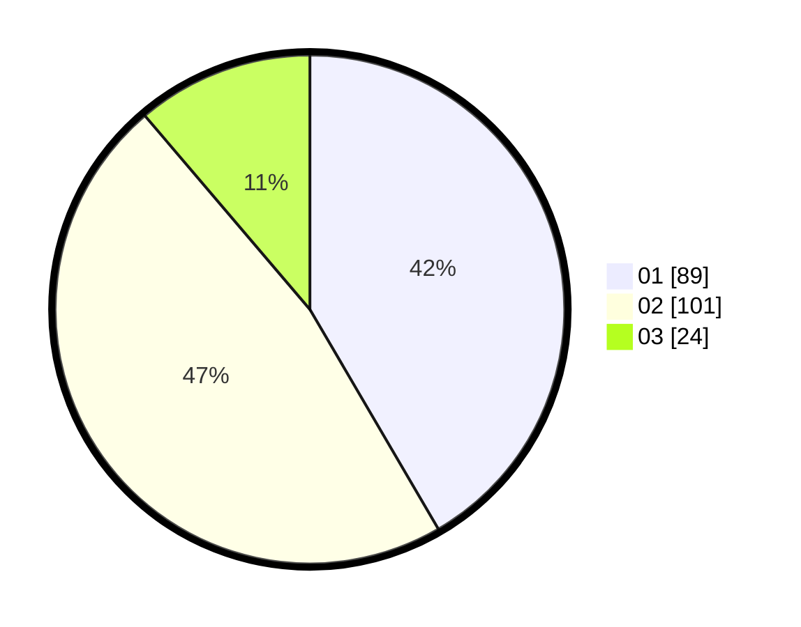

# Hasil

Hasil perolehan suara paslon dapat dilihat pada file paslon-01.txt, paslon-02.txt, dan paslon-03.txt.

Jika tidak ada, artinya data tersebut belum ada pada SIREKAP.

## Perolehan Suara

 * Paslon 01: **89**.
 * Paslon 02: **101**.
 * Paslon 03: **24**.

## Foto C Plano

https://sirekap-obj-formc.kpu.go.id/d93b/pemilu/ppwp/31/75/05/10/03/3175051003133-20240214-215005--79967c82-38cc-47d9-9aba-789c21c0beb0.jpg

https://sirekap-obj-formc.kpu.go.id/d93b/pemilu/ppwp/31/75/05/10/03/3175051003133-20240214-215102--456be8fd-eaf8-4614-ad62-b5baf34d896b.jpg

https://sirekap-obj-formc.kpu.go.id/d93b/pemilu/ppwp/31/75/05/10/03/3175051003133-20240214-215145--87829192-8268-45e5-9b20-d1347a86ed3a.jpg
