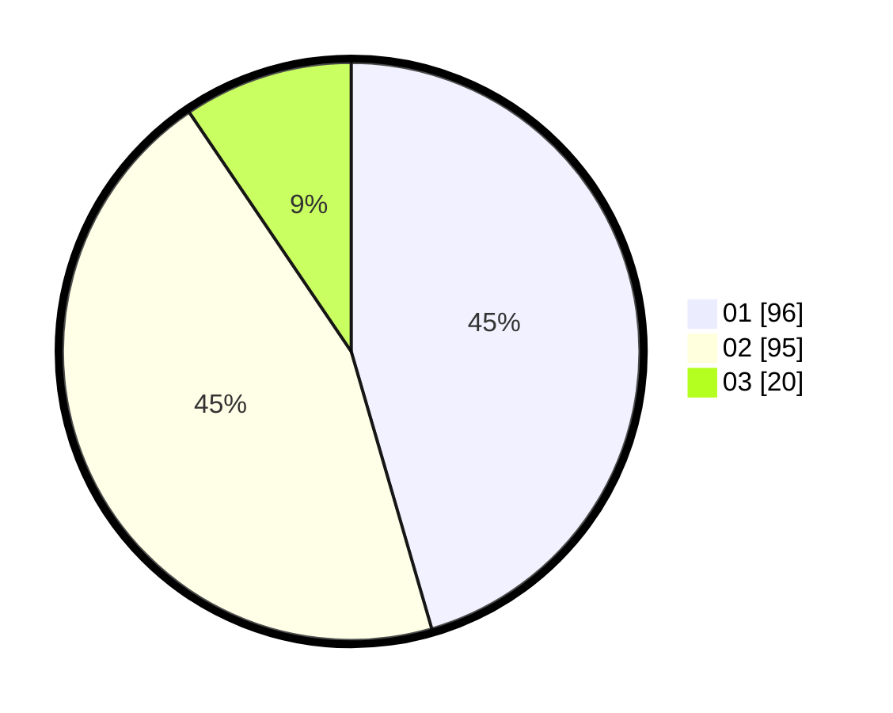

# Hasil

Hasil perolehan suara paslon dapat dilihat pada file paslon-01.txt, paslon-02.txt, dan paslon-03.txt.

Jika tidak ada, artinya data tersebut belum ada pada SIREKAP.

## Perolehan Suara

 * Paslon 01: **96**.
 * Paslon 02: **95**.
 * Paslon 03: **20**.

## Foto C Plano

https://sirekap-obj-formc.kpu.go.id/d485/pemilu/ppwp/31/75/05/10/03/3175051003135-20240214-195806--2978d22a-d032-42e0-9763-27d26952a297.jpg

https://sirekap-obj-formc.kpu.go.id/d485/pemilu/ppwp/31/75/05/10/03/3175051003135-20240214-155257--6772955a-d9c1-433d-8767-ad68415eb59b.jpg

https://sirekap-obj-formc.kpu.go.id/d485/pemilu/ppwp/31/75/05/10/03/3175051003135-20240214-155439--3b5805f4-4f2b-4977-8737-90ba99650116.jpg
