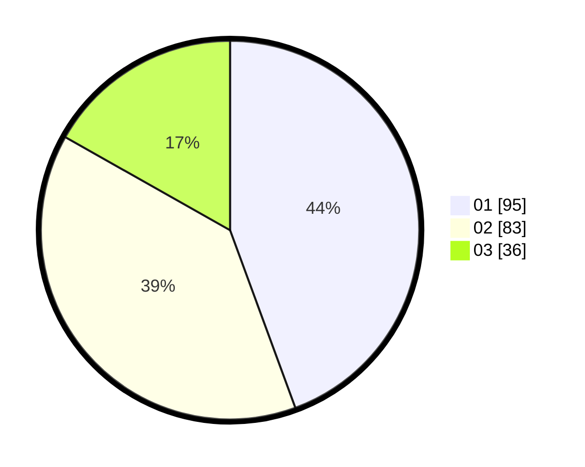

# Hasil

Hasil perolehan suara paslon dapat dilihat pada file paslon-01.txt, paslon-02.txt, dan paslon-03.txt.

Jika tidak ada, artinya data tersebut belum ada pada SIREKAP.

## Perolehan Suara

 * Paslon 01: **95**.
 * Paslon 02: **83**.
 * Paslon 03: **36**.

## Foto C Plano

https://sirekap-obj-formc.kpu.go.id/0261/pemilu/ppwp/31/75/05/10/03/3175051003138-20240214-190445--bd0ae26c-d332-4059-b273-17d245916699.jpg

https://sirekap-obj-formc.kpu.go.id/0261/pemilu/ppwp/31/75/05/10/03/3175051003138-20240214-210725--0e7c416e-57bb-4bd0-9102-3fd23887c983.jpg

https://sirekap-obj-formc.kpu.go.id/0261/pemilu/ppwp/31/75/05/10/03/3175051003138-20240214-191233--7f2581ef-94c2-431a-ade5-204776b7f1d9.jpg

## DATA PEMILIH TETAP

Jumlah pemilih dalam DPT: **255**.
 * L: **128**.
 * P: **127**.

## DATA PENGGUNA HAK PILIH

Jumlah pengguna hak pilih dalam DPT: **211**.
 * L: **104**.
 * P: **107**.

Jumlah pengguna hak pilih dalam DPTb: **6**.
 * L: **3**.
 * P: **3**.

Jumlah pengguna hak pilih dalam DPK: **2**.
 * L: **0**.
 * P: **2**.

Jumlah pengguna hak pilih: **219**.
 * L: **107**.
 * P: **112**.

## JUMLAH SUARA SAH DAN TIDAK SAH

JUMLAH SELURUH SUARA SAH: **214**.

JUMLAH SUARA TIDAK SAH: **5**.

JUMLAH SELURUH SUARA SAH DAN SUARA TIDAK SAH: **219**.
