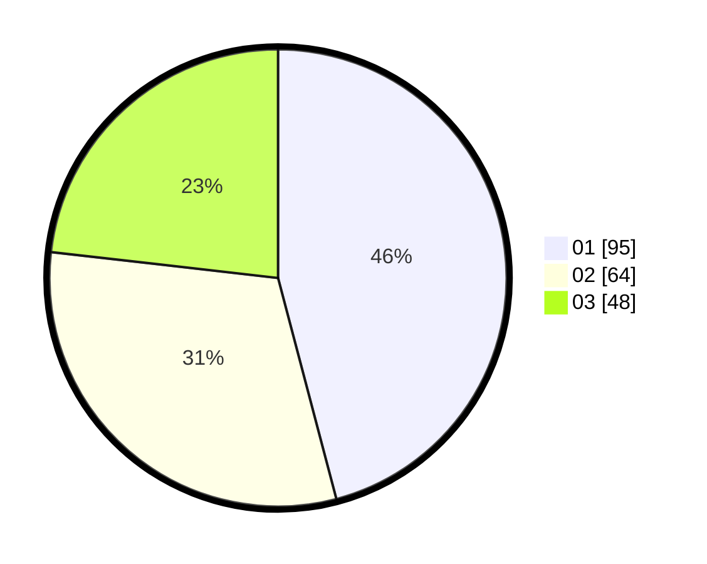

# Hasil

Hasil perolehan suara paslon dapat dilihat pada file paslon-01.txt, paslon-02.txt, dan paslon-03.txt.

Jika tidak ada, artinya data tersebut belum ada pada SIREKAP.

## Perolehan Suara

 * Paslon 01: **95**.
 * Paslon 02: **64**.
 * Paslon 03: **48**.

## Foto C Plano

https://sirekap-obj-formc.kpu.go.id/9226/pemilu/ppwp/31/75/05/10/03/3175051003139-20240214-230536--081bd822-1721-4627-b5bc-8e43dbd868a0.jpg

https://sirekap-obj-formc.kpu.go.id/9226/pemilu/ppwp/31/75/05/10/03/3175051003139-20240214-230726--451948f6-2b8a-4119-ae2b-08fd943e782d.jpg
