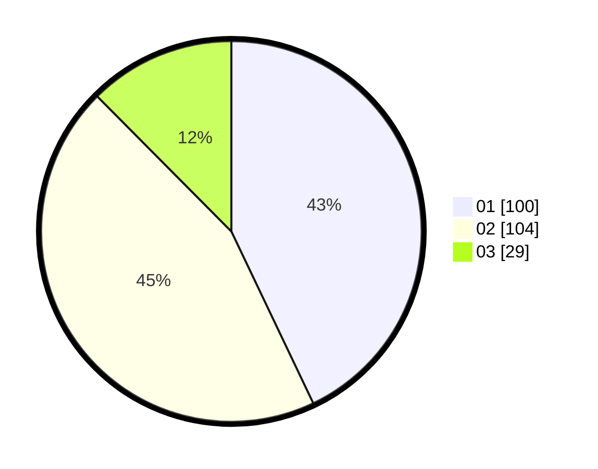

# Hasil

Hasil perolehan suara paslon dapat dilihat pada file paslon-01.txt, paslon-02.txt, dan paslon-03.txt.

Jika tidak ada, artinya data tersebut belum ada pada SIREKAP.

## Perolehan Suara

 * Paslon 01: **100**.
 * Paslon 02: **104**.
 * Paslon 03: **29**.

## Foto C Plano

https://sirekap-obj-formc.kpu.go.id/eb78/pemilu/ppwp/31/75/05/10/03/3175051003141-20240214-155358--46dd5691-c52f-45dc-a583-a5a483d7b9c3.jpg

https://sirekap-obj-formc.kpu.go.id/eb78/pemilu/ppwp/31/75/05/10/03/3175051003141-20240214-185527--06973075-0d15-4bc7-b392-6c9b0d8b1714.jpg

https://sirekap-obj-formc.kpu.go.id/eb78/pemilu/ppwp/31/75/05/10/03/3175051003141-20240214-155104--605b38a6-2b3c-488e-9b11-8f7050f6915f.jpg

## DATA PEMILIH TETAP

Jumlah pemilih dalam DPT: **266**.
 * L: **132**.
 * P: **134**.

## DATA PENGGUNA HAK PILIH

Jumlah pengguna hak pilih dalam DPT: **230**.
 * L: **112**.
 * P: **118**.

Jumlah pengguna hak pilih dalam DPTb: **1**.
 * L: **1**.
 * P: **0**.

Jumlah pengguna hak pilih dalam DPK: **2**.
 * L: **0**.
 * P: **2**.

Jumlah pengguna hak pilih: **233**.
 * L: **113**.
 * P: **120**.

## JUMLAH SUARA SAH DAN TIDAK SAH

JUMLAH SELURUH SUARA SAH: **233**.

JUMLAH SUARA TIDAK SAH: **0**.

JUMLAH SELURUH SUARA SAH DAN SUARA TIDAK SAH: **233**.
