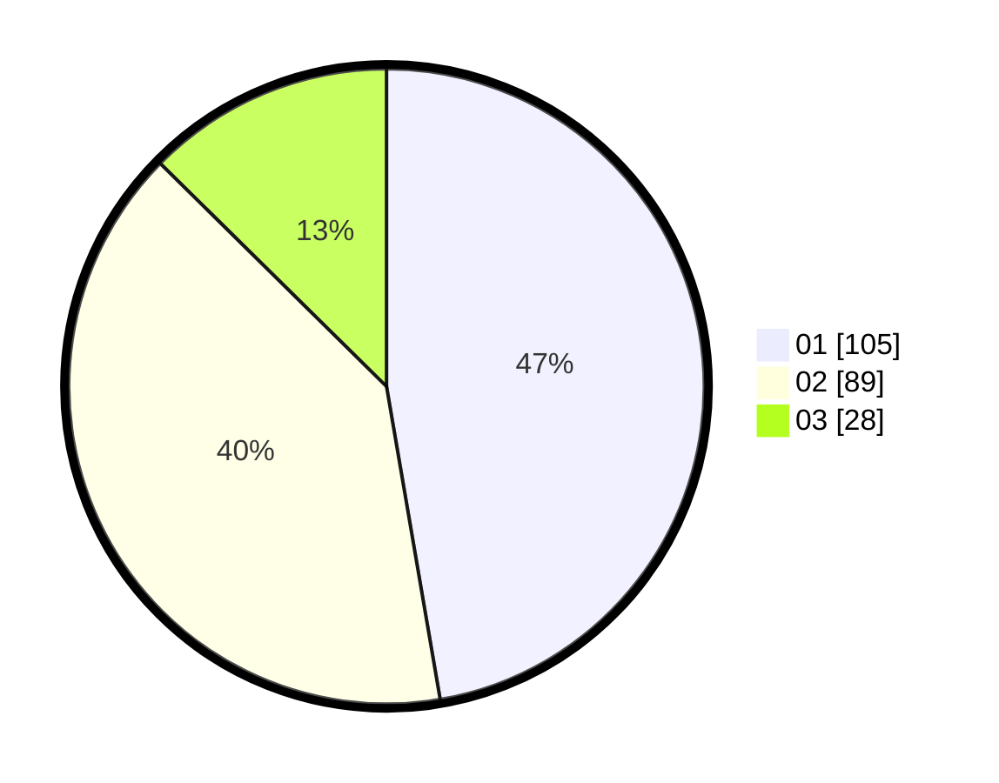

# Hasil

Hasil perolehan suara paslon dapat dilihat pada file paslon-01.txt, paslon-02.txt, dan paslon-03.txt.

Jika tidak ada, artinya data tersebut belum ada pada SIREKAP.

## Perolehan Suara

 * Paslon 01: **105**.
 * Paslon 02: **89**.
 * Paslon 03: **28**.

## Foto C Plano

https://sirekap-obj-formc.kpu.go.id/cf80/pemilu/ppwp/31/75/05/10/04/3175051004009-20240214-193146--27e2f8b8-83e3-422a-904c-809141a3526b.jpg

https://sirekap-obj-formc.kpu.go.id/cf80/pemilu/ppwp/31/75/05/10/04/3175051004009-20240214-194006--64a04987-0582-4dae-acab-9782b26d5d53.jpg

https://sirekap-obj-formc.kpu.go.id/cf80/pemilu/ppwp/31/75/05/10/04/3175051004009-20240214-155256--e107f288-b0a5-47c8-9a3d-30758bf625e7.jpg

## DATA PEMILIH TETAP

Jumlah pemilih dalam DPT: **290**.
 * L: **147**.
 * P: **143**.

## DATA PENGGUNA HAK PILIH

Jumlah pengguna hak pilih dalam DPT: **209**.
 * L: **99**.
 * P: **110**.

Jumlah pengguna hak pilih dalam DPTb: **13**.
 * L: **11**.
 * P: **2**.

Jumlah pengguna hak pilih dalam DPK: **2**.
 * L: **1**.
 * P: **1**.

Jumlah pengguna hak pilih: **224**.
 * L: **111**.
 * P: **113**.

## JUMLAH SUARA SAH DAN TIDAK SAH

JUMLAH SELURUH SUARA SAH: **222**.

JUMLAH SUARA TIDAK SAH: **2**.

JUMLAH SELURUH SUARA SAH DAN SUARA TIDAK SAH: **224**.
