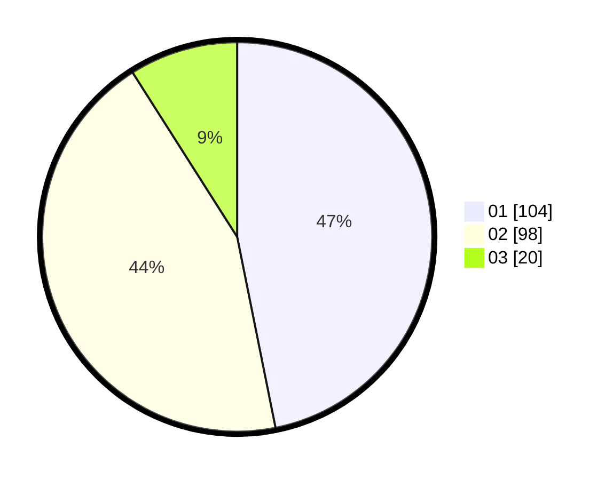

# Hasil

Hasil perolehan suara paslon dapat dilihat pada file paslon-01.txt, paslon-02.txt, dan paslon-03.txt.

Jika tidak ada, artinya data tersebut belum ada pada SIREKAP.

## Perolehan Suara

 * Paslon 01: **104**.
 * Paslon 02: **98**.
 * Paslon 03: **20**.

## Foto C Plano

https://sirekap-obj-formc.kpu.go.id/de24/pemilu/ppwp/31/75/05/10/04/3175051004019-20240214-222514--7a826272-ac81-4cd5-a18e-568f626daff2.jpg

https://sirekap-obj-formc.kpu.go.id/de24/pemilu/ppwp/31/75/05/10/04/3175051004019-20240214-204654--c0010883-407b-410e-9267-6795570c2340.jpg

https://sirekap-obj-formc.kpu.go.id/de24/pemilu/ppwp/31/75/05/10/04/3175051004019-20240214-191133--da5b4ac5-8017-4a5d-a96a-7bc8a7668373.jpg
