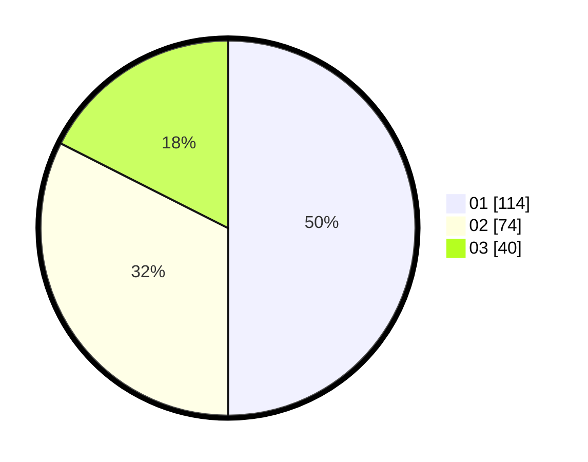

# Hasil

Hasil perolehan suara paslon dapat dilihat pada file paslon-01.txt, paslon-02.txt, dan paslon-03.txt.

Jika tidak ada, artinya data tersebut belum ada pada SIREKAP.

## Perolehan Suara

 * Paslon 01: **114**.
 * Paslon 02: **74**.
 * Paslon 03: **40**.

## Foto C Plano

https://sirekap-obj-formc.kpu.go.id/787f/pemilu/ppwp/31/75/05/10/04/3175051004027-20240214-200112--74ed2d57-b49f-442a-aa08-d75df34e5daa.jpg

https://sirekap-obj-formc.kpu.go.id/787f/pemilu/ppwp/31/75/05/10/04/3175051004027-20240214-200218--3900c6a7-f4a3-4ab0-86d4-23efdb62f986.jpg

https://sirekap-obj-formc.kpu.go.id/787f/pemilu/ppwp/31/75/05/10/04/3175051004027-20240214-200400--ac848784-907b-4a8a-b652-d71603558d9f.jpg

## DATA PEMILIH TETAP

Jumlah pemilih dalam DPT: **281**.
 * L: **139**.
 * P: **142**.

## DATA PENGGUNA HAK PILIH

Jumlah pengguna hak pilih dalam DPT: **227**.
 * L: **107**.
 * P: **120**.

Jumlah pengguna hak pilih dalam DPTb: **1**.
 * L: **1**.
 * P: **0**.

Jumlah pengguna hak pilih dalam DPK: **0**.
 * L: **0**.
 * P: **0**.

Jumlah pengguna hak pilih: **228**.
 * L: **108**.
 * P: **120**.

## JUMLAH SUARA SAH DAN TIDAK SAH

JUMLAH SELURUH SUARA SAH: **228**.

JUMLAH SUARA TIDAK SAH: **0**.

JUMLAH SELURUH SUARA SAH DAN SUARA TIDAK SAH: **228**.
