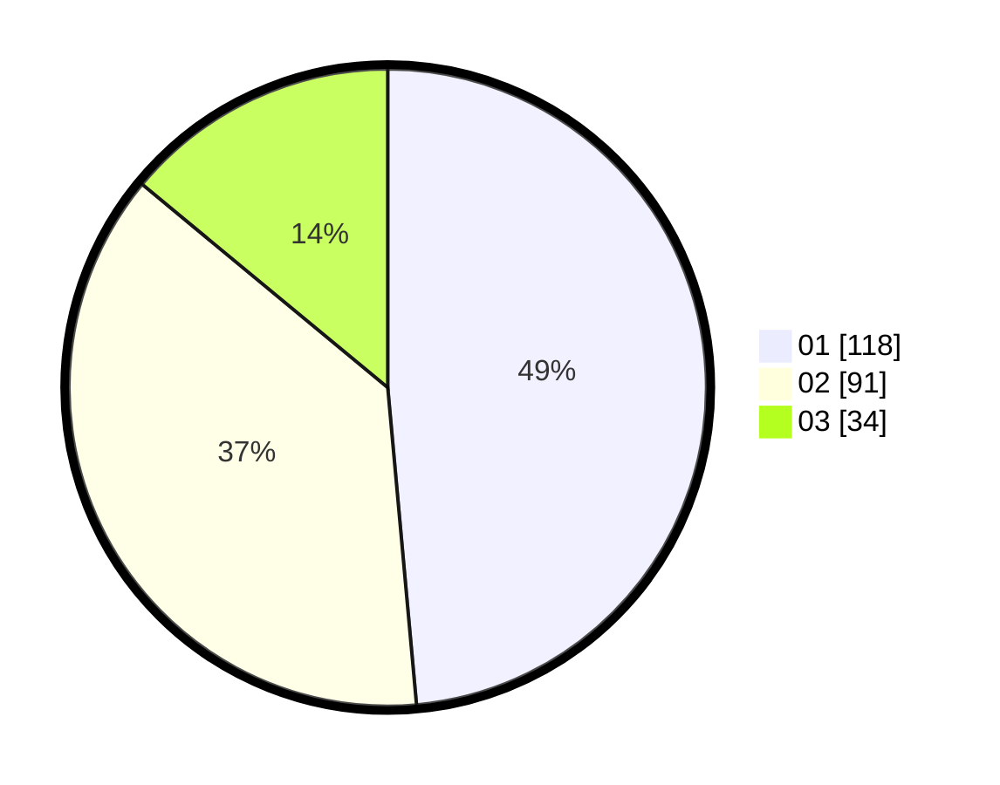

# Hasil

Hasil perolehan suara paslon dapat dilihat pada file paslon-01.txt, paslon-02.txt, dan paslon-03.txt.

Jika tidak ada, artinya data tersebut belum ada pada SIREKAP.

## Perolehan Suara

 * Paslon 01: **118**.
 * Paslon 02: **91**.
 * Paslon 03: **34**.

## Foto C Plano

https://sirekap-obj-formc.kpu.go.id/18f3/pemilu/ppwp/31/75/05/10/04/3175051004030-20240214-185716--2fa05c20-0723-47ae-8ac0-986b2c6fa688.jpg

https://sirekap-obj-formc.kpu.go.id/18f3/pemilu/ppwp/31/75/05/10/04/3175051004030-20240214-185926--524cf0ea-1824-4e27-a560-cfa7d9eef530.jpg

https://sirekap-obj-formc.kpu.go.id/18f3/pemilu/ppwp/31/75/05/10/04/3175051004030-20240214-185305--7f2a9102-21e5-4fc7-a16b-e6ef1eeb3d54.jpg

## DATA PEMILIH TETAP

Jumlah pemilih dalam DPT: **280**.
 * L: **135**.
 * P: **145**.

## DATA PENGGUNA HAK PILIH

Jumlah pengguna hak pilih dalam DPT: **243**.
 * L: **114**.
 * P: **129**.

Jumlah pengguna hak pilih dalam DPTb: **5**.
 * L: **3**.
 * P: **2**.

Jumlah pengguna hak pilih dalam DPK: **0**.
 * L: **0**.
 * P: **0**.

Jumlah pengguna hak pilih: **248**.
 * L: **117**.
 * P: **131**.

## JUMLAH SUARA SAH DAN TIDAK SAH

JUMLAH SELURUH SUARA SAH: **243**.

JUMLAH SUARA TIDAK SAH: **5**.

JUMLAH SELURUH SUARA SAH DAN SUARA TIDAK SAH: **248**.
