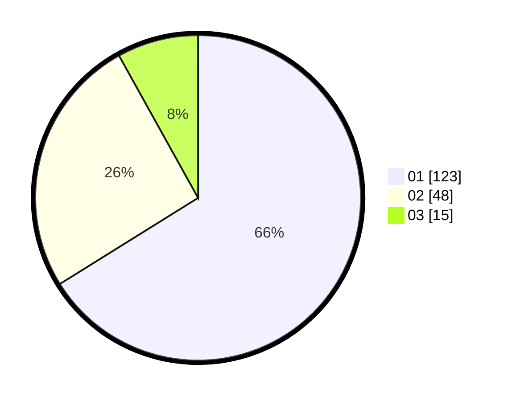

# Hasil

Hasil perolehan suara paslon dapat dilihat pada file paslon-01.txt, paslon-02.txt, dan paslon-03.txt.

Jika tidak ada, artinya data tersebut belum ada pada SIREKAP.

## Perolehan Suara

 * Paslon 01: **123**.
 * Paslon 02: **48**.
 * Paslon 03: **15**.

## Foto C Plano

https://sirekap-obj-formc.kpu.go.id/e758/pemilu/ppwp/31/75/05/10/04/3175051004031-20240215-032023--166d1684-8673-4af0-8d5d-c696ee2ebe53.jpg

https://sirekap-obj-formc.kpu.go.id/e758/pemilu/ppwp/31/75/05/10/04/3175051004031-20240215-032045--d3fe756a-35f9-47c2-9869-d2f68da4cad7.jpg

https://sirekap-obj-formc.kpu.go.id/e758/pemilu/ppwp/31/75/05/10/04/3175051004031-20240215-032049--1e939529-855b-412f-a480-d605d6ec3d1a.jpg

## DATA PEMILIH TETAP

Jumlah pemilih dalam DPT: **282**.
 * L: **125**.
 * P: **157**.

## DATA PENGGUNA HAK PILIH

Jumlah pengguna hak pilih dalam DPT: **224**.
 * L: **92**.
 * P: **132**.

Jumlah pengguna hak pilih dalam DPTb: **0**.
 * L: **0**.
 * P: **0**.

Jumlah pengguna hak pilih dalam DPK: **5**.
 * L: **3**.
 * P: **2**.

Jumlah pengguna hak pilih: **229**.
 * L: **95**.
 * P: **134**.

## JUMLAH SUARA SAH DAN TIDAK SAH

JUMLAH SELURUH SUARA SAH: **226**.

JUMLAH SUARA TIDAK SAH: **3**.

JUMLAH SELURUH SUARA SAH DAN SUARA TIDAK SAH: **229**.
