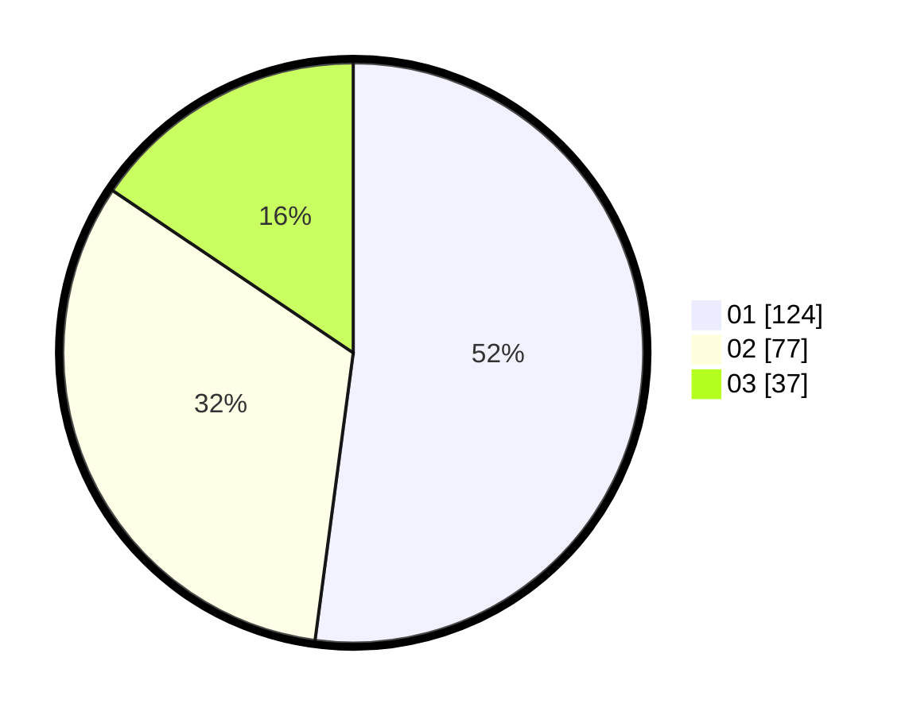

# Hasil

Hasil perolehan suara paslon dapat dilihat pada file paslon-01.txt, paslon-02.txt, dan paslon-03.txt.

Jika tidak ada, artinya data tersebut belum ada pada SIREKAP.

## Perolehan Suara

 * Paslon 01: **124**.
 * Paslon 02: **77**.
 * Paslon 03: **37**.

## Foto C Plano

https://sirekap-obj-formc.kpu.go.id/0ee8/pemilu/ppwp/31/75/05/10/04/3175051004040-20240214-193819--c4dadc10-78dd-41da-82e5-6cb0007629c3.jpg

https://sirekap-obj-formc.kpu.go.id/0ee8/pemilu/ppwp/31/75/05/10/04/3175051004040-20240214-155220--ead149d8-e0c3-4cb3-b9a4-802372d3d997.jpg

https://sirekap-obj-formc.kpu.go.id/0ee8/pemilu/ppwp/31/75/05/10/04/3175051004040-20240214-155302--d09ba886-22e7-4e13-995a-ebe7f75d73a3.jpg
