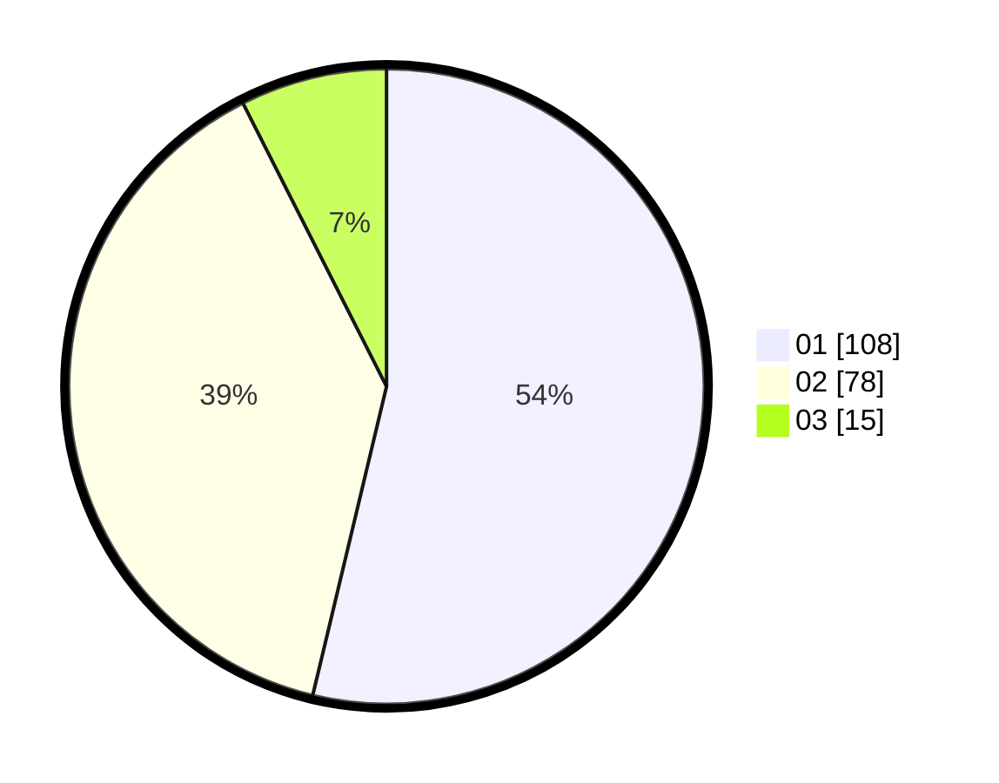

# Hasil

Hasil perolehan suara paslon dapat dilihat pada file paslon-01.txt, paslon-02.txt, dan paslon-03.txt.

Jika tidak ada, artinya data tersebut belum ada pada SIREKAP.

## Perolehan Suara

 * Paslon 01: **108**.
 * Paslon 02: **78**.
 * Paslon 03: **15**.

## Foto C Plano

https://sirekap-obj-formc.kpu.go.id/f311/pemilu/ppwp/31/75/05/10/04/3175051004055-20240214-231814--db179f2b-1a11-4a0d-ab20-26cda926b70b.jpg

https://sirekap-obj-formc.kpu.go.id/f311/pemilu/ppwp/31/75/05/10/04/3175051004055-20240214-232221--20629b85-e225-45ec-8eaa-c22f1276c197.jpg

https://sirekap-obj-formc.kpu.go.id/f311/pemilu/ppwp/31/75/05/10/04/3175051004055-20240214-232256--d839dbe1-8d39-4e2b-87cd-a120e68b8828.jpg
