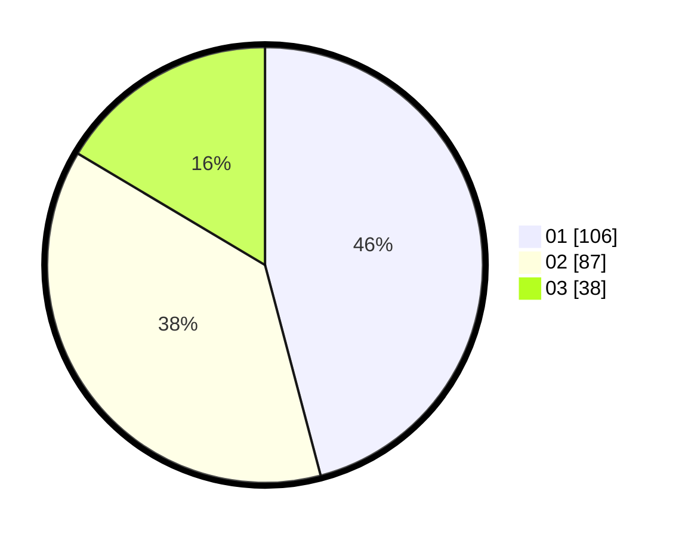

# Hasil

Hasil perolehan suara paslon dapat dilihat pada file paslon-01.txt, paslon-02.txt, dan paslon-03.txt.

Jika tidak ada, artinya data tersebut belum ada pada SIREKAP.

## Perolehan Suara

 * Paslon 01: **106**.
 * Paslon 02: **87**.
 * Paslon 03: **38**.

## Foto C Plano

https://sirekap-obj-formc.kpu.go.id/97b3/pemilu/ppwp/31/75/05/10/04/3175051004060-20240215-034832--d6649d71-e63d-4c2a-a185-4b525065f91d.jpg

https://sirekap-obj-formc.kpu.go.id/97b3/pemilu/ppwp/31/75/05/10/04/3175051004060-20240214-234821--287e4238-30c9-4d8d-abbb-b4de981f944a.jpg

https://sirekap-obj-formc.kpu.go.id/97b3/pemilu/ppwp/31/75/05/10/04/3175051004060-20240214-234832--e65d1517-ac5c-4a72-a57e-0dea11ab54b9.jpg
