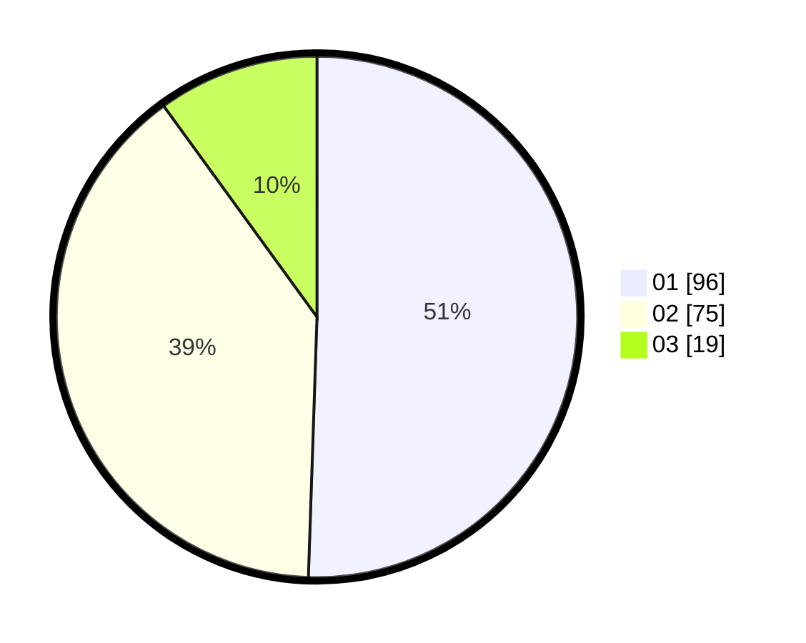

# Hasil

Hasil perolehan suara paslon dapat dilihat pada file paslon-01.txt, paslon-02.txt, dan paslon-03.txt.

Jika tidak ada, artinya data tersebut belum ada pada SIREKAP.

## Perolehan Suara

 * Paslon 01: **96**.
 * Paslon 02: **75**.
 * Paslon 03: **19**.

## Foto C Plano

https://sirekap-obj-formc.kpu.go.id/5d6b/pemilu/ppwp/31/75/05/10/04/3175051004061-20240215-012523--2faa0b36-c91f-46b5-a3d4-993c56dc6bf4.jpg

https://sirekap-obj-formc.kpu.go.id/5d6b/pemilu/ppwp/31/75/05/10/04/3175051004061-20240215-012629--12acd384-6ea0-4069-8b06-fc4c9d9c5a40.jpg

https://sirekap-obj-formc.kpu.go.id/5d6b/pemilu/ppwp/31/75/05/10/04/3175051004061-20240215-012707--94e87f86-06b3-4f22-ab0c-8ace02726b62.jpg

## DATA PEMILIH TETAP

Jumlah pemilih dalam DPT: **257**.
 * L: **116**.
 * P: **141**.

## DATA PENGGUNA HAK PILIH

Jumlah pengguna hak pilih dalam DPT: **192**.
 * L: **82**.
 * P: **110**.

Jumlah pengguna hak pilih dalam DPTb: **1**.
 * L: **0**.
 * P: **1**.

Jumlah pengguna hak pilih dalam DPK: **0**.
 * L: **0**.
 * P: **0**.

Jumlah pengguna hak pilih: **193**.
 * L: **82**.
 * P: **111**.

## JUMLAH SUARA SAH DAN TIDAK SAH

JUMLAH SELURUH SUARA SAH: **190**.

JUMLAH SUARA TIDAK SAH: **3**.

JUMLAH SELURUH SUARA SAH DAN SUARA TIDAK SAH: **193**.
