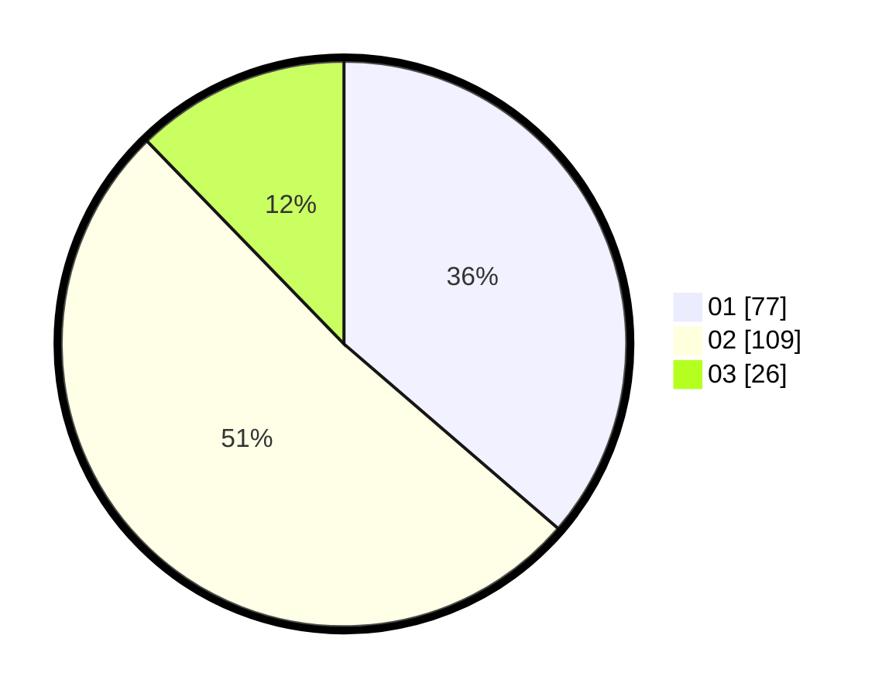

# Hasil

Hasil perolehan suara paslon dapat dilihat pada file paslon-01.txt, paslon-02.txt, dan paslon-03.txt.

Jika tidak ada, artinya data tersebut belum ada pada SIREKAP.

## Perolehan Suara

 * Paslon 01: **77**.
 * Paslon 02: **109**.
 * Paslon 03: **26**.

## Foto C Plano

https://sirekap-obj-formc.kpu.go.id/0044/pemilu/ppwp/31/75/05/10/04/3175051004064-20240216-054051--41b8b68b-7b11-4fbd-a805-20a9b9bfba2f.jpg

https://sirekap-obj-formc.kpu.go.id/0044/pemilu/ppwp/31/75/05/10/04/3175051004064-20240214-194252--1db57e9d-568e-40a4-9c48-a81f1457d72b.jpg

https://sirekap-obj-formc.kpu.go.id/0044/pemilu/ppwp/31/75/05/10/04/3175051004064-20240214-194257--a443c963-a576-42e0-a431-7e4984c0b9ca.jpg

## DATA PEMILIH TETAP

Jumlah pemilih dalam DPT: **262**.
 * L: **123**.
 * P: **139**.

## DATA PENGGUNA HAK PILIH

Jumlah pengguna hak pilih dalam DPT: **212**.
 * L: **97**.
 * P: **115**.

Jumlah pengguna hak pilih dalam DPTb: **0**.
 * L: **0**.
 * P: **0**.

Jumlah pengguna hak pilih dalam DPK: **3**.
 * L: **1**.
 * P: **2**.

Jumlah pengguna hak pilih: **215**.
 * L: **98**.
 * P: **117**.

## JUMLAH SUARA SAH DAN TIDAK SAH

JUMLAH SELURUH SUARA SAH: **212**.

JUMLAH SUARA TIDAK SAH: **3**.

JUMLAH SELURUH SUARA SAH DAN SUARA TIDAK SAH: **215**.
