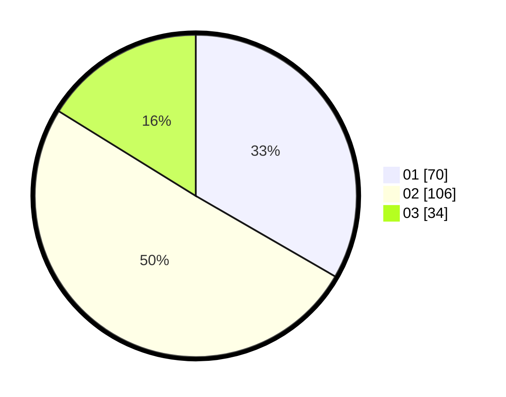

# Hasil

Hasil perolehan suara paslon dapat dilihat pada file paslon-01.txt, paslon-02.txt, dan paslon-03.txt.

Jika tidak ada, artinya data tersebut belum ada pada SIREKAP.

## Perolehan Suara

 * Paslon 01: **70**.
 * Paslon 02: **106**.
 * Paslon 03: **34**.

## Foto C Plano

https://sirekap-obj-formc.kpu.go.id/0293/pemilu/ppwp/31/75/05/10/04/3175051004069-20240214-225022--2ddf4501-1273-412c-9b75-0f47d5a54ffe.jpg

https://sirekap-obj-formc.kpu.go.id/0293/pemilu/ppwp/31/75/05/10/04/3175051004069-20240214-225132--604576a0-9e06-48da-9534-43abec6372d9.jpg

https://sirekap-obj-formc.kpu.go.id/0293/pemilu/ppwp/31/75/05/10/04/3175051004069-20240214-225312--2e291bef-f844-44b6-a6f0-11af8bbe4002.jpg

## DATA PEMILIH TETAP

Jumlah pemilih dalam DPT: **264**.
 * L: **120**.
 * P: **144**.

## DATA PENGGUNA HAK PILIH

Jumlah pengguna hak pilih dalam DPT: **207**.
 * L: **90**.
 * P: **117**.

Jumlah pengguna hak pilih dalam DPTb: **2**.
 * L: **2**.
 * P: **0**.

Jumlah pengguna hak pilih dalam DPK: **2**.
 * L: **1**.
 * P: **1**.

Jumlah pengguna hak pilih: **211**.
 * L: **93**.
 * P: **118**.

## JUMLAH SUARA SAH DAN TIDAK SAH

JUMLAH SELURUH SUARA SAH: **210**.

JUMLAH SUARA TIDAK SAH: **1**.

JUMLAH SELURUH SUARA SAH DAN SUARA TIDAK SAH: **211**.
