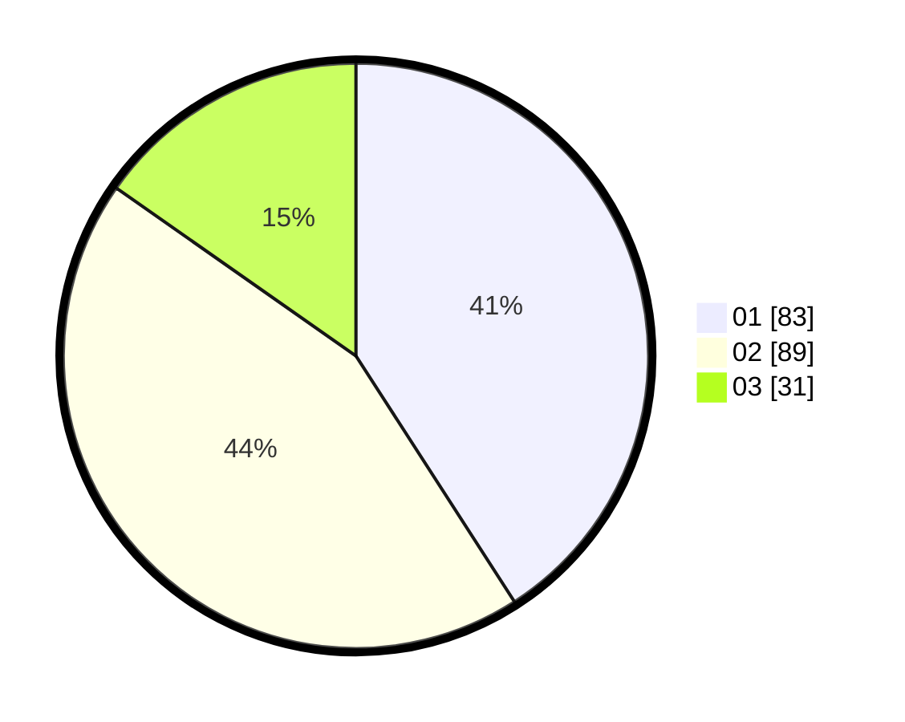

# Hasil

Hasil perolehan suara paslon dapat dilihat pada file paslon-01.txt, paslon-02.txt, dan paslon-03.txt.

Jika tidak ada, artinya data tersebut belum ada pada SIREKAP.

## Perolehan Suara

 * Paslon 01: **83**.
 * Paslon 02: **89**.
 * Paslon 03: **31**.

## Foto C Plano

https://sirekap-obj-formc.kpu.go.id/a326/pemilu/ppwp/31/75/05/10/04/3175051004073-20240214-194422--110fea2c-ef80-4e44-aba6-dff9369b5e4b.jpg

https://sirekap-obj-formc.kpu.go.id/a326/pemilu/ppwp/31/75/05/10/04/3175051004073-20240214-194859--5932121a-6bcf-43dc-b204-b0b12558e51e.jpg

https://sirekap-obj-formc.kpu.go.id/a326/pemilu/ppwp/31/75/05/10/04/3175051004073-20240214-194903--d1fc7285-4770-4383-859a-ecdcfb419d05.jpg

## DATA PEMILIH TETAP

Jumlah pemilih dalam DPT: **262**.
 * L: **129**.
 * P: **133**.

## DATA PENGGUNA HAK PILIH

Jumlah pengguna hak pilih dalam DPT: **200**.
 * L: **95**.
 * P: **105**.

Jumlah pengguna hak pilih dalam DPTb: **3**.
 * L: **1**.
 * P: **2**.

Jumlah pengguna hak pilih dalam DPK: **1**.
 * L: **0**.
 * P: **1**.

Jumlah pengguna hak pilih: **204**.
 * L: **96**.
 * P: **108**.

## JUMLAH SUARA SAH DAN TIDAK SAH

JUMLAH SELURUH SUARA SAH: **203**.

JUMLAH SUARA TIDAK SAH: **1**.

JUMLAH SELURUH SUARA SAH DAN SUARA TIDAK SAH: **204**.
