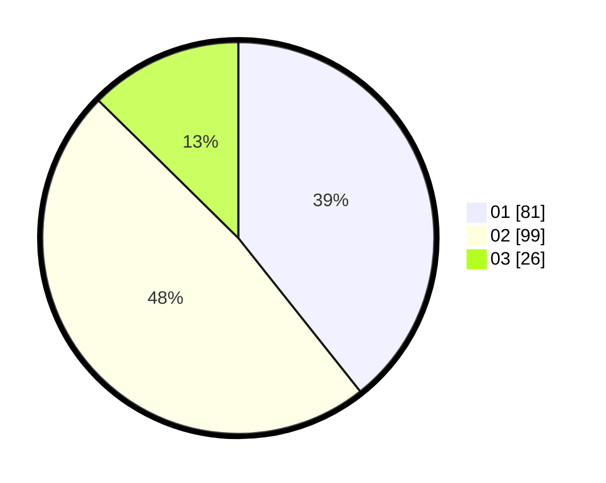

# Hasil

Hasil perolehan suara paslon dapat dilihat pada file paslon-01.txt, paslon-02.txt, dan paslon-03.txt.

Jika tidak ada, artinya data tersebut belum ada pada SIREKAP.

## Perolehan Suara

 * Paslon 01: **81**.
 * Paslon 02: **99**.
 * Paslon 03: **26**.

## Foto C Plano

https://sirekap-obj-formc.kpu.go.id/0370/pemilu/ppwp/31/75/05/10/04/3175051004079-20240214-212714--5e7667ae-0d80-441c-931a-f2b0c6e6fbd0.jpg

https://sirekap-obj-formc.kpu.go.id/0370/pemilu/ppwp/31/75/05/10/04/3175051004079-20240214-223803--616f6ced-6ffb-4bb8-8d3c-423b2723659d.jpg

https://sirekap-obj-formc.kpu.go.id/0370/pemilu/ppwp/31/75/05/10/04/3175051004079-20240214-223820--ddefadf7-86ec-4d80-9fd2-5e4e6eba66af.jpg
