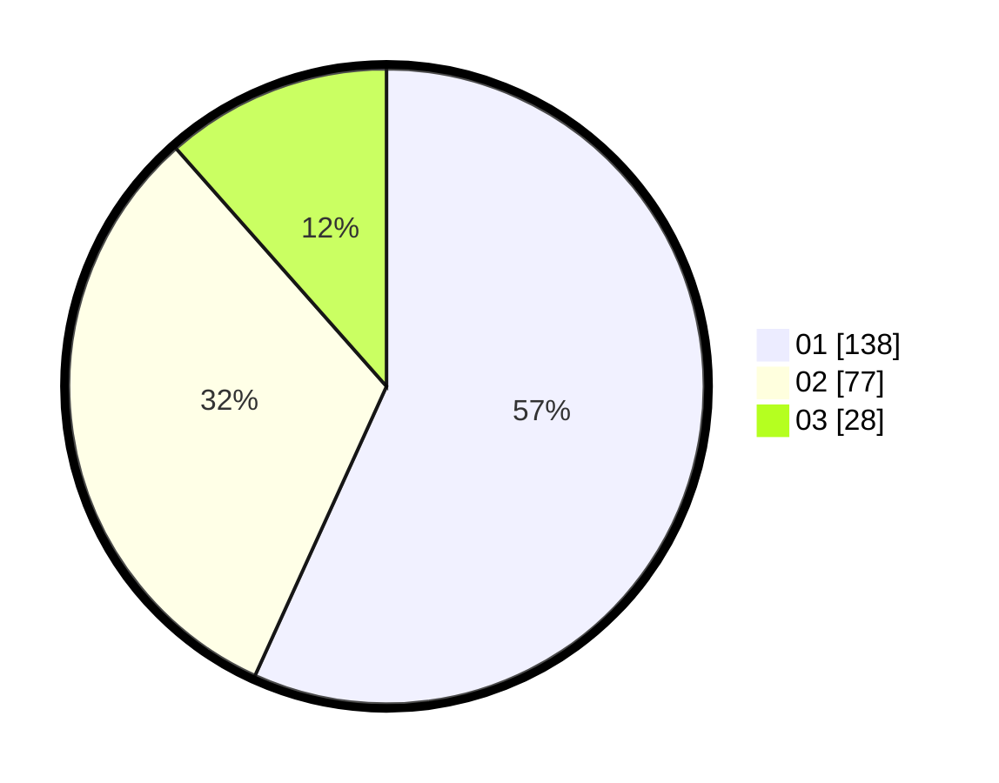

# Hasil

Hasil perolehan suara paslon dapat dilihat pada file paslon-01.txt, paslon-02.txt, dan paslon-03.txt.

Jika tidak ada, artinya data tersebut belum ada pada SIREKAP.

## Perolehan Suara

 * Paslon 01: **138**.
 * Paslon 02: **77**.
 * Paslon 03: **28**.

## Foto C Plano

https://sirekap-obj-formc.kpu.go.id/9daa/pemilu/ppwp/31/75/05/10/04/3175051004081-20240214-223257--dc595157-5cc4-4d03-a8da-98f2148bc89f.jpg

https://sirekap-obj-formc.kpu.go.id/9daa/pemilu/ppwp/31/75/05/10/04/3175051004081-20240214-223043--ac32c51d-c3c6-43fa-8f95-1a6ad0507be3.jpg

https://sirekap-obj-formc.kpu.go.id/9daa/pemilu/ppwp/31/75/05/10/04/3175051004081-20240214-223351--189e2cd9-8139-49e0-ac4c-f19fd8399576.jpg
