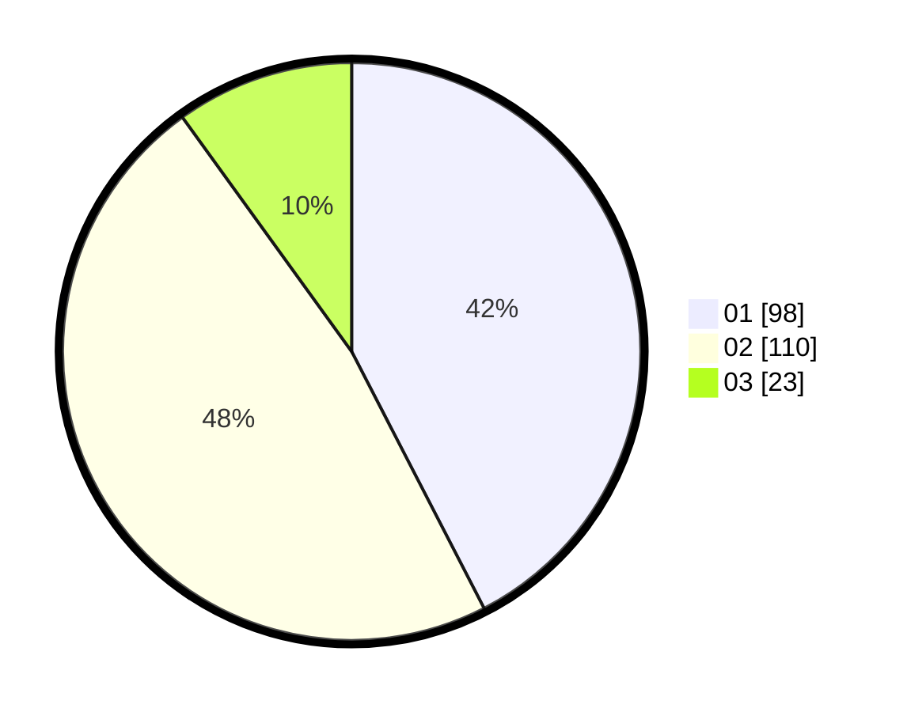

# Hasil

Hasil perolehan suara paslon dapat dilihat pada file paslon-01.txt, paslon-02.txt, dan paslon-03.txt.

Jika tidak ada, artinya data tersebut belum ada pada SIREKAP.

## Perolehan Suara

 * Paslon 01: **98**.
 * Paslon 02: **110**.
 * Paslon 03: **23**.

## Foto C Plano

https://sirekap-obj-formc.kpu.go.id/3b7d/pemilu/ppwp/31/75/05/10/04/3175051004092-20240214-235045--e28e1e2b-8503-4039-9207-352f256966a3.jpg

https://sirekap-obj-formc.kpu.go.id/3b7d/pemilu/ppwp/31/75/05/10/04/3175051004092-20240214-235120--a70e07ad-c920-4deb-9ec0-8d331d28c5ce.jpg

https://sirekap-obj-formc.kpu.go.id/3b7d/pemilu/ppwp/31/75/05/10/04/3175051004092-20240214-235206--2c7bee3c-9263-4e9e-aaa4-2750fff56103.jpg

## DATA PEMILIH TETAP

Jumlah pemilih dalam DPT: **272**.
 * L: **131**.
 * P: **141**.

## DATA PENGGUNA HAK PILIH

Jumlah pengguna hak pilih dalam DPT: **232**.
 * L: **113**.
 * P: **119**.

Jumlah pengguna hak pilih dalam DPTb: **1**.
 * L: **1**.
 * P: **0**.

Jumlah pengguna hak pilih dalam DPK: **0**.
 * L: **0**.
 * P: **0**.

Jumlah pengguna hak pilih: **233**.
 * L: **114**.
 * P: **119**.

## JUMLAH SUARA SAH DAN TIDAK SAH

JUMLAH SELURUH SUARA SAH: **231**.

JUMLAH SUARA TIDAK SAH: **2**.

JUMLAH SELURUH SUARA SAH DAN SUARA TIDAK SAH: **233**.
