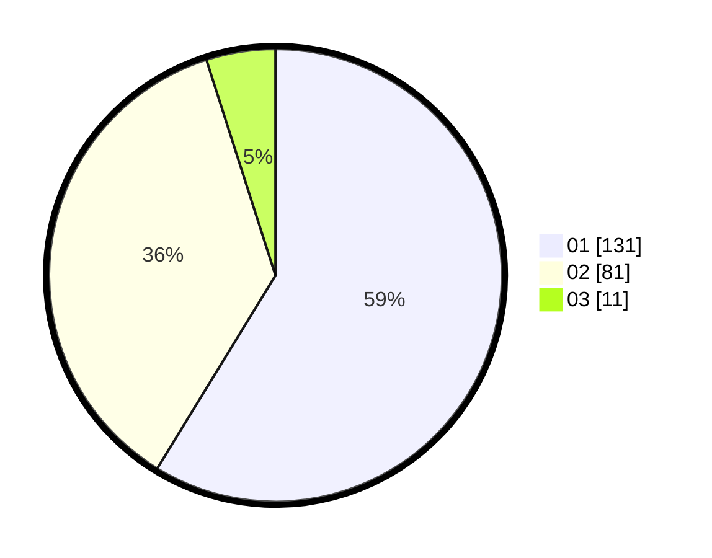

# Hasil

Hasil perolehan suara paslon dapat dilihat pada file paslon-01.txt, paslon-02.txt, dan paslon-03.txt.

Jika tidak ada, artinya data tersebut belum ada pada SIREKAP.

## Perolehan Suara

 * Paslon 01: **131**.
 * Paslon 02: **81**.
 * Paslon 03: **11**.

## Foto C Plano

https://sirekap-obj-formc.kpu.go.id/5158/pemilu/ppwp/31/75/05/10/04/3175051004096-20240215-012043--29b058c9-7b1f-4416-b17c-9810e9856234.jpg

https://sirekap-obj-formc.kpu.go.id/5158/pemilu/ppwp/31/75/05/10/04/3175051004096-20240215-012714--bd56022b-a441-4f00-bbf7-ce0680687e60.jpg

https://sirekap-obj-formc.kpu.go.id/5158/pemilu/ppwp/31/75/05/10/04/3175051004096-20240215-012913--9fa2e565-ed52-45a8-94c5-36ef3c7657cb.jpg
