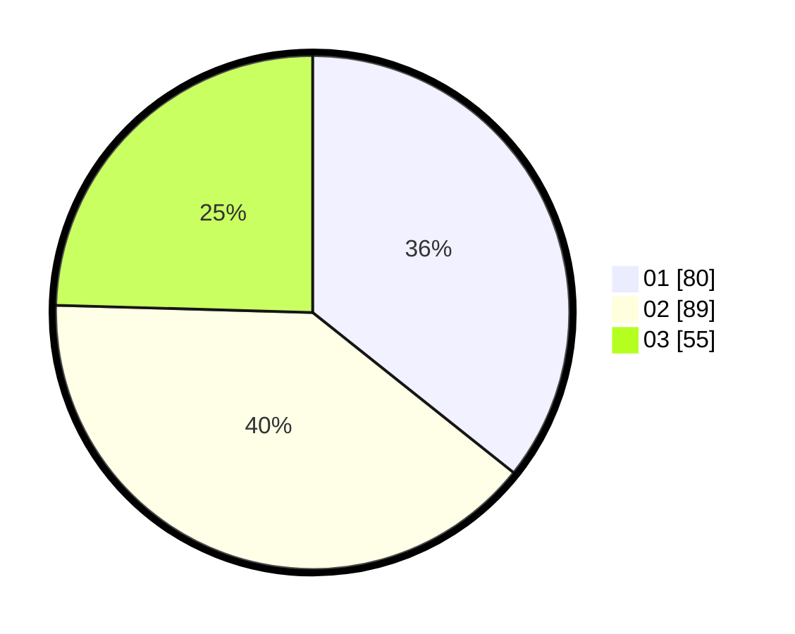

# Hasil

Hasil perolehan suara paslon dapat dilihat pada file paslon-01.txt, paslon-02.txt, dan paslon-03.txt.

Jika tidak ada, artinya data tersebut belum ada pada SIREKAP.

## Perolehan Suara

 * Paslon 01: **80**.
 * Paslon 02: **89**.
 * Paslon 03: **55**.

## Foto C Plano

https://sirekap-obj-formc.kpu.go.id/8a89/pemilu/ppwp/31/75/05/10/04/3175051004097-20240215-140438--98cfded9-dd65-42ed-b903-6434d616996b.jpg

https://sirekap-obj-formc.kpu.go.id/8a89/pemilu/ppwp/31/75/05/10/04/3175051004097-20240215-140446--5f548b5d-2bb3-48f2-9609-90eac1422fe8.jpg

https://sirekap-obj-formc.kpu.go.id/8a89/pemilu/ppwp/31/75/05/10/04/3175051004097-20240215-140450--922ac2e9-6117-4985-80bb-1a38afded631.jpg
