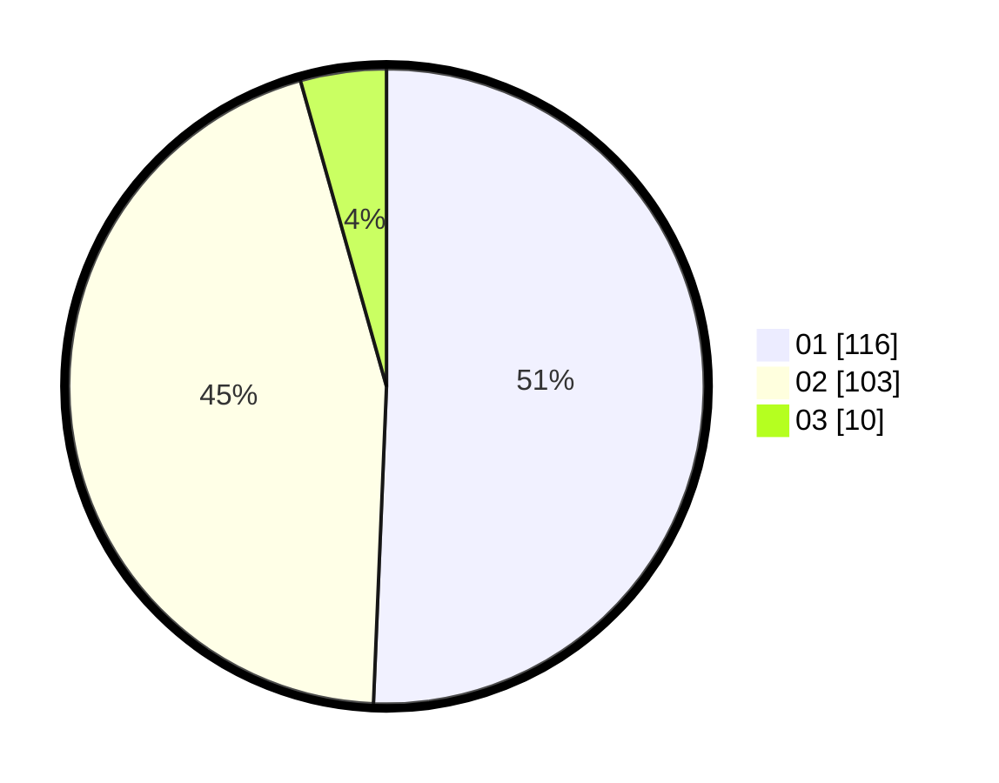

# Hasil

Hasil perolehan suara paslon dapat dilihat pada file paslon-01.txt, paslon-02.txt, dan paslon-03.txt.

Jika tidak ada, artinya data tersebut belum ada pada SIREKAP.

## Perolehan Suara

 * Paslon 01: **116**.
 * Paslon 02: **103**.
 * Paslon 03: **10**.

## Foto C Plano

https://sirekap-obj-formc.kpu.go.id/d92b/pemilu/ppwp/31/75/05/10/04/3175051004098-20240216-142353--bd0ff87b-7fbd-4605-a3a3-a44911e7321b.jpg

https://sirekap-obj-formc.kpu.go.id/d92b/pemilu/ppwp/31/75/05/10/04/3175051004098-20240214-192558--ba0e11e7-2816-41a2-8588-854e71fbdb8c.jpg

https://sirekap-obj-formc.kpu.go.id/d92b/pemilu/ppwp/31/75/05/10/04/3175051004098-20240214-192851--e9a0f642-1645-4f48-8e0f-fc666c6dbde3.jpg

## DATA PEMILIH TETAP

Jumlah pemilih dalam DPT: **276**.
 * L: **136**.
 * P: **140**.

## DATA PENGGUNA HAK PILIH

Jumlah pengguna hak pilih dalam DPT: **229**.
 * L: **106**.
 * P: **123**.

Jumlah pengguna hak pilih dalam DPTb: **2**.
 * L: **1**.
 * P: **1**.

Jumlah pengguna hak pilih dalam DPK: **0**.
 * L: **0**.
 * P: **0**.

Jumlah pengguna hak pilih: **231**.
 * L: **107**.
 * P: **124**.

## JUMLAH SUARA SAH DAN TIDAK SAH

JUMLAH SELURUH SUARA SAH: **229**.

JUMLAH SUARA TIDAK SAH: **2**.

JUMLAH SELURUH SUARA SAH DAN SUARA TIDAK SAH: **231**.
