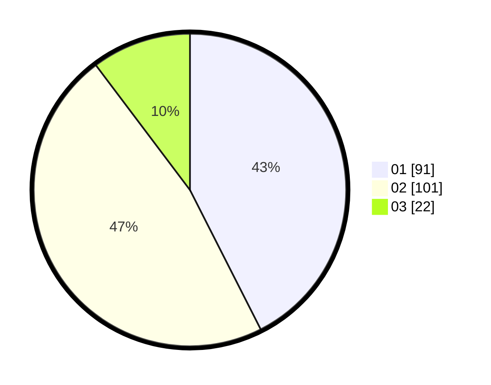

# Hasil

Hasil perolehan suara paslon dapat dilihat pada file paslon-01.txt, paslon-02.txt, dan paslon-03.txt.

Jika tidak ada, artinya data tersebut belum ada pada SIREKAP.

## Perolehan Suara

 * Paslon 01: **91**.
 * Paslon 02: **101**.
 * Paslon 03: **22**.

## Foto C Plano

https://sirekap-obj-formc.kpu.go.id/12e2/pemilu/ppwp/31/75/05/10/04/3175051004099-20240215-053233--14066a6b-c2e8-4505-8441-2949304ae6ce.jpg

https://sirekap-obj-formc.kpu.go.id/12e2/pemilu/ppwp/31/75/05/10/04/3175051004099-20240215-053612--a8b7ad09-788a-4122-9618-a7336efa105e.jpg

https://sirekap-obj-formc.kpu.go.id/12e2/pemilu/ppwp/31/75/05/10/04/3175051004099-20240215-053418--05885e3a-fb4c-4bb2-8410-468ee7966198.jpg

## DATA PEMILIH TETAP

Jumlah pemilih dalam DPT: **275**.
 * L: **134**.
 * P: **141**.

## DATA PENGGUNA HAK PILIH

Jumlah pengguna hak pilih dalam DPT: **219**.
 * L: **104**.
 * P: **115**.

Jumlah pengguna hak pilih dalam DPTb: **1**.
 * L: **1**.
 * P: **0**.

Jumlah pengguna hak pilih dalam DPK: **0**.
 * L: **0**.
 * P: **0**.

Jumlah pengguna hak pilih: **220**.
 * L: **105**.
 * P: **115**.

## JUMLAH SUARA SAH DAN TIDAK SAH

JUMLAH SELURUH SUARA SAH: **214**.

JUMLAH SUARA TIDAK SAH: **5**.

JUMLAH SELURUH SUARA SAH DAN SUARA TIDAK SAH: **219**.
