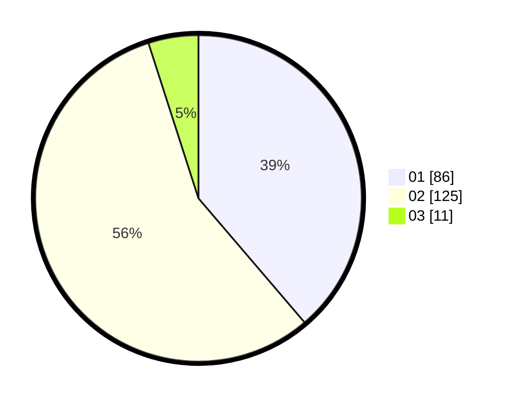

# Hasil

Hasil perolehan suara paslon dapat dilihat pada file paslon-01.txt, paslon-02.txt, dan paslon-03.txt.

Jika tidak ada, artinya data tersebut belum ada pada SIREKAP.

## Perolehan Suara

 * Paslon 01: **86**.
 * Paslon 02: **125**.
 * Paslon 03: **11**.

## Foto C Plano

https://sirekap-obj-formc.kpu.go.id/cbb0/pemilu/ppwp/31/75/05/10/04/3175051004102-20240214-230151--ee8ecc93-49cd-460f-884d-1d1c5abd5bc1.jpg

https://sirekap-obj-formc.kpu.go.id/cbb0/pemilu/ppwp/31/75/05/10/04/3175051004102-20240214-230515--fe01a2fd-e7b9-480e-a7cc-7ad43875d84f.jpg

https://sirekap-obj-formc.kpu.go.id/cbb0/pemilu/ppwp/31/75/05/10/04/3175051004102-20240214-230806--e117b317-bb02-42bc-af9b-bfdac05a716c.jpg
